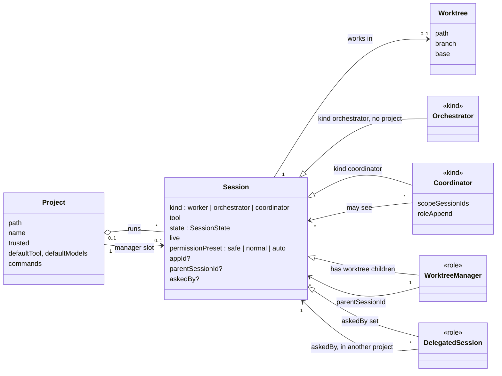
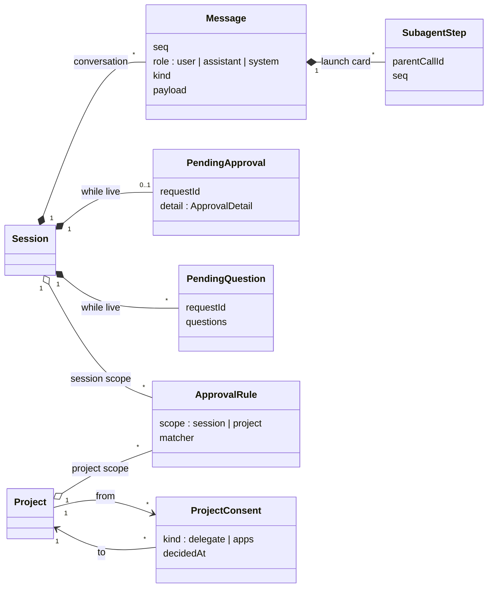
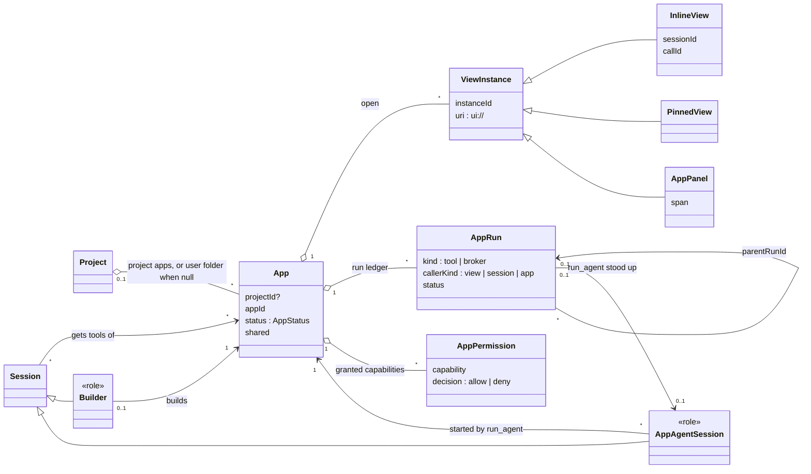
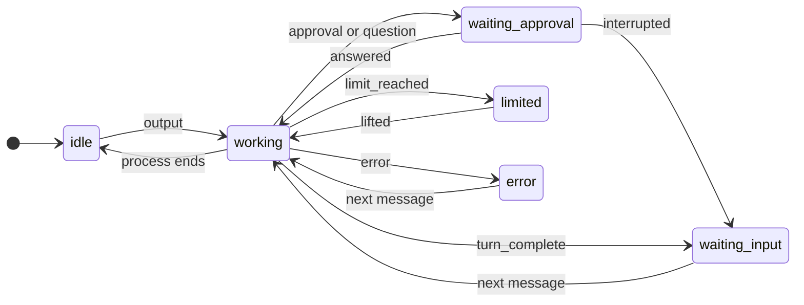
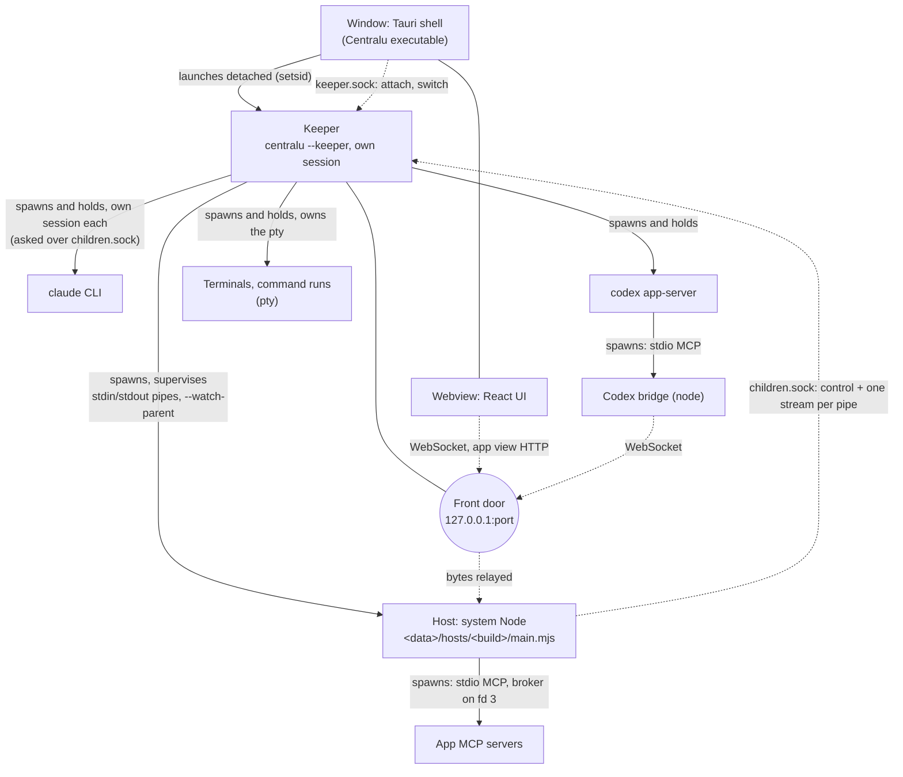
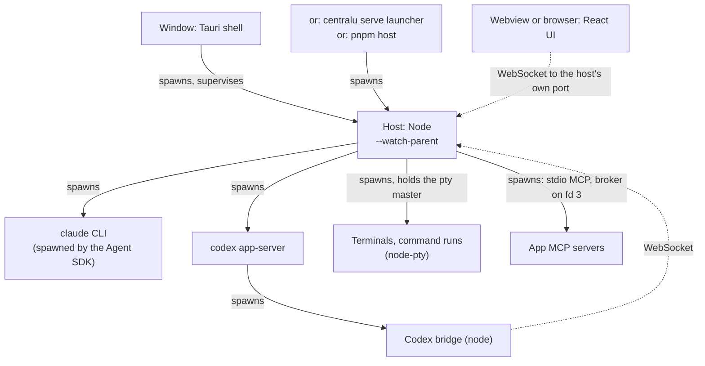
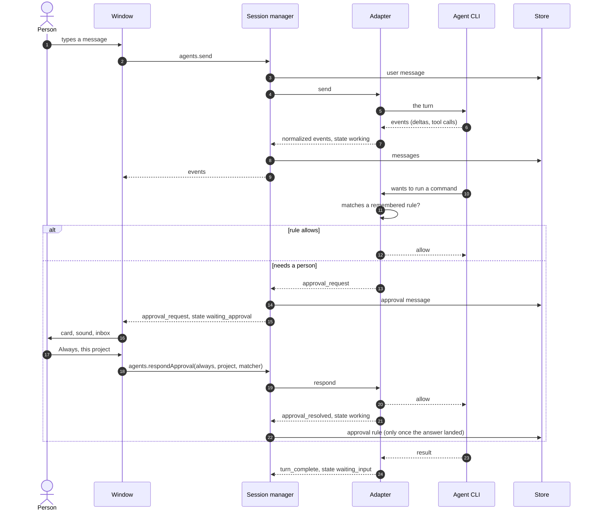
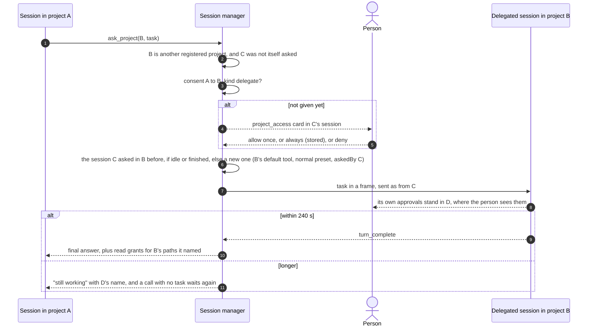
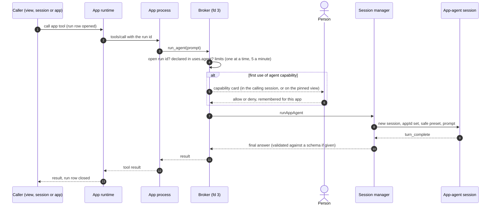
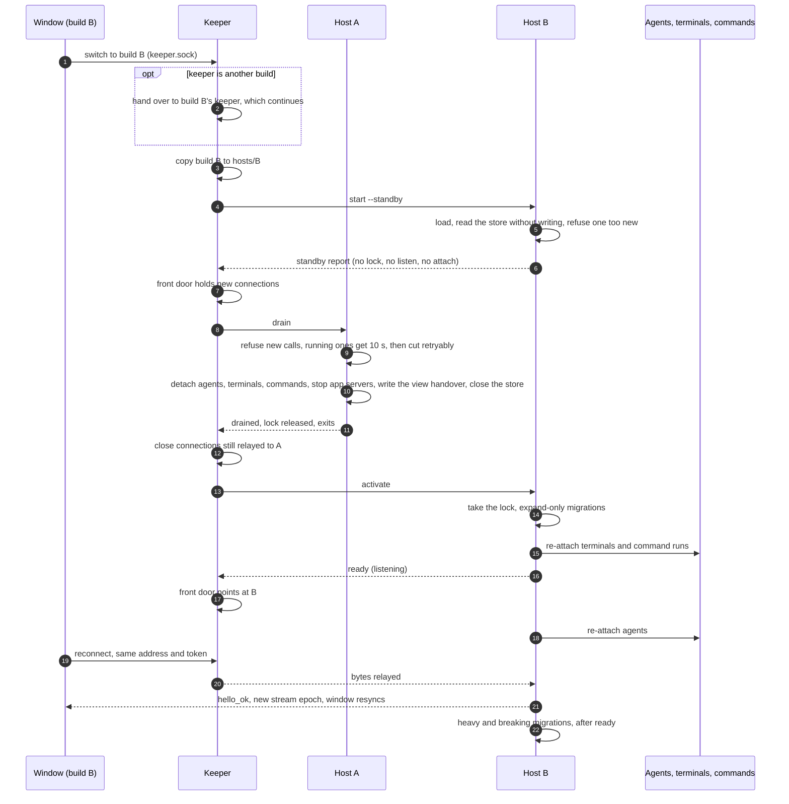

# 도메인 모델

> 영어 원본: [domain-model.md](domain-model.md) — 설계가 바뀌면 두 문서를 같은 PR에서 함께 갱신한다.

Centralu의 코드, 문서, 화면이 쓰는 말이 각각 무엇을 뜻하는지, 그 말이 가리키는 것들이 서로 어떻게 이어지는지,
각각이 어디서 정의되고 어디에 저장되는지를 모았다. 낯선 이름을 만나면 다른 설계 문서보다 이것을 먼저 읽는다.

GyuHo123이 [#411](https://github.com/ijun17/centralu/issues/411)에 그린 모델을 바탕으로, `main`의 코드와 하나하나
대조해 지금에 맞게 고쳤다(2026-10-06).

두 층으로 되어 있다:

| 층 | 무엇 | 관리 방법 |
|---|---|---|
| 개념(이 문서) | 용어, 관계, 세션 상태 기계, 프로세스 트리, 주요 흐름 | 손으로. 개념을 바꾸는 코드와 같은 PR에서 |
| 스키마([generated/schema.md](generated/schema.md)) | 스토어의 모든 테이블과 컬럼, 키, 그것을 더한 마이그레이션 단계 | `pnpm docs:schema`가 실제 스토어에서 생성한다. 낡으면 테스트가 실패한다 |

이 문서는 개념의 높이에 머문다. 컬럼 목록은 두지 않는다. 두 층은 두 테스트가 묶는다
(`packages/agent-host/src/dev-services/schema-doc.test.ts`): 생성된 파일은 마이그레이션이 만드는 것과 같아야 하고,
스토어의 모든 테이블은 아래 **저장되는 곳** 목록 가운데 하나에 이름이 나와야 한다.

그림은 Mermaid로 그린 UML이다. `<<kind>>`는 세션이 무엇으로 만들어지는지를, `<<role>>`은 세션이 **관계로 인해**
무엇인지를 표시한다. 역할은 그때그때 관계에서 읽어 낸다. 경로는 저장소 루트 기준이다.

## 1. 용어집

### 1.1 프로젝트와 세션

| 용어 | 뜻 | 정의된 곳 | 피할 말 |
|---|---|---|---|
| 프로젝트 | Centralu에 등록한 폴더. 세션, 규칙, 동의, 앱, 저장한 명령, 커밋 귀속이 여기에 달린다. git 저장소가 아니어도 된다 | `ProjectInfo`, `packages/protocol/src/commands.ts` | 워크스페이스, 레포 |
| 신뢰한 프로젝트 | 사람이 예라고 답한 프로젝트. 신뢰해야 그 앱이 돌고 저장소 설정(`.claude/`)이 적용된다. 새 프로젝트는 신뢰하지 않은 채로 시작한다 | `projects.trusted`; [apps.ko.md](apps.ko.md) §3 | |
| 세션 | 에이전트 도구 하나와의 대화 하나. 자기 프로세스(살아 있을 때), 상태, 모델, 권한 프리셋을 가진다 | `SessionInfo`, `packages/protocol/src/commands.ts` | 채팅, 스레드, 에이전트 |
| 에이전트 도구 | 세션이 돌리는 CLI: Claude Code 또는 Codex. 세 번째를 더할 수 있게 문자열이다 | `ToolName`, `packages/protocol/src/entities.ts`; 어댑터는 `packages/agent-host/src/adapters/` | 모델, 프로바이더 |
| 어댑터 | 에이전트 도구 하나를 공통 계약으로 감싸고, 그 출력을 정규화된 이벤트로 바꾸는 모듈 | `AgentAdapter`, `packages/agent-host/src/adapters/contract.ts` | 드라이버 |
| 세션 종류 | 세션이 무엇으로 만들어지는가: `worker`(평범한 세션 전부), `orchestrator`, `coordinator`. 그대로 저장하지 않는다. `is_orchestrator`와 코디네이터의 구성원 목록이 있는지에서 읽어 낸다 | `SessionKind`, `packages/protocol/src/commands.ts`; 읽어 내는 곳은 `Store`, `packages/agent-host/src/dev-services/store.ts` | |
| 오케스트레이터 | 앱 전체에 하나뿐인, 모든 세션을 보고 지휘하는 세션. 어느 프로젝트에도 속하지 않는다 | `kind: 'orchestrator'`; `packages/agent-host/src/sessions/orchestrator-tools.ts`, `orchestrator-home.ts` | 프로젝트 오케스트레이터(폐지) |
| 평범한 세션 | 빌더도, 매니저도, 앱의 에이전트도 아닌 프로젝트 안의 `worker`. 읽기 전용 `reader` 도구를 받는다(워크트리 세션과 위임된 세션도). 설정에서 끌 수 있다 | `readsOwnProject`, `packages/agent-host/src/sessions/manager.ts` | |
| 워크트리 매니저 | `<<role>>` 아래에 워크트리 세션을 둔 세션, 또는 프로젝트의 매니저 자리가 가리키는 세션. 자기 자식만 지휘한다 | `isWorktreeManager`, `manager.ts`; `projects.worktree_manager` | 리드, 부모 |
| 워크트리 세션(워커) | 자기 git 워크트리와 브랜치에서 일하는 세션. 언제나 매니저 아래에 있다(`parentSessionId`) | `SessionInfo.worktree`, `parentSessionId` | 브랜치 세션 |
| 코디네이터 | 볼 수 있는 세션 목록(`scopeSessionIds`)과 역할 글(`roleAppend`)을 만들 때 정해 둔 세션. `agents.createCoordinator`로 만든다. 이것을 만들던 관제 앱은 걷어냈다(#372). 종류와 RPC는 남아 있지만 지금은 아무도 RPC를 부르지 않고, 옛 코디네이터는 `appId: 'control'`을 달고 있다 | `kind: 'coordinator'`; `createCoordinator`, `manager.ts` | 하위 오케스트레이터 |
| 빌더 | `<<role>>` 앱 하나를 만드는 세션. `appId`를 달고 **그리고** 빌더 지도(`apps.builders`)에서 그 앱이 가리키는 세션 | `builderRefOf`, `manager.ts`; `packages/agent-host/src/sessions/app-builder.ts` | |
| 앱 에이전트 세션 | `<<role>>` 앱이 `run_agent`로 세운 세션. `appId`를 달지만 빌더가 아니고, `safe`로 돌며, 앱도 reader 도구도 받지 않고, 답은 앱에게 돌아간다 | `isAppAgentSession`, `runAppAgent`, `manager.ts`; `packages/agent-host/src/sessions/app-agents.ts` | |
| 위임된("부탁받은") 세션 | `<<role>>` 다른 프로젝트의 세션이 `ask_project`로 세우거나 다시 쓴 세션. `askedBy`로 표시한다 | `SessionInfo.askedBy`; `packages/agent-host/src/sessions/ask-project.ts`; [agent-host.ko.md](agent-host.ko.md) §1.2 | 델리게이트 |
| 도구 프로필 | 세션이 받는 Centralu 자체 도구(`centralu` MCP 서버) 묶음: `orchestrator`, `manager`, `scoped`, `builder`, `reader`, 또는 없음 | `toolProfileOf`, `manager.ts`; [agent-host.ko.md](agent-host.ko.md) §1.1 | |
| 권한 프리셋 | 에이전트가 묻지 않고 해도 되는 범위: `safe`, `normal`, `auto` | `PermissionPreset`, `entities.ts` | 모드 |
| 살아 있음 | 세션에 지금 프로세스가 있는가. 살아 있지 않은 세션은 말을 걸면 이어 띄운다 | `SessionInfo.live` | 보관(FR-20은 폐지) |
| 휴지통 | 지운 세션을 영영 사라지기 전 한동안 두는 곳 | `sessions.deleted_at`, `trash`; product-spec FR-22 | 보관 |
| 가져온 세션 | 도구가 Centralu 밖에서 시작한 대화를 이어 가는 세션 | `SessionInfo.importedFrom`; [agent-host.ko.md](agent-host.ko.md) §8 | |
| 인계(세션) | 새 후임 세션(어느 도구든)이 노트를 통해 전임의 일을 넘겨받는 것. 노트는 에이전트가 직접 쓰거나, 저장된 대화에서 모델 없이 만든다(#78). 노트는 파일 `<data>/handoff/<project>/<session>.md`이고 후임의 첫 메시지가 그 경로를 가리킨다. 전임은 기본으로 지운다 | `handoff` 이벤트, `packages/protocol/src/events.ts`; `packages/agent-host/src/dev-services/handoff-notes.ts`, `sessions/handoff-record.ts` | (키퍼 인계와 다르다, §1.5) |
| 도구 바꾸기 | 세션(이름, 순서, 기록, 패널)은 그대로 두고 그 아래의 에이전트 도구만 바꾸는 것. 새 도구는 새 스레드로 시작한다. 옛 도구의 대화는 에이전트에게 넘어가지 않고, 기록만 화면에 남는다 | `agents.switchTool`, `packages/protocol/src/commands.ts`; `switchTool`, `manager.ts` | |
| 목표 | 세션에 정한 목적. 도구가 판정한다. 살아 있는 동안만 | `SessionGoal`, `entities.ts` | |
| 백그라운드 작업 | 에이전트가 자기 프로세스 안에 돌려 둔 일(서브에이전트, 셸). 살아 있는 동안만 | `BackgroundTask`, `entities.ts` | |

### 1.2 대화

| 용어 | 뜻 | 정의된 곳 | 피할 말 |
|---|---|---|---|
| 턴 | 메시지 하나에서 `turn_complete`까지, 에이전트가 한 번 도는 것 | `turn_complete`, `events.ts` | |
| 정규화된 이벤트 | 어댑터가 도구의 출력을 바꿔 놓은 것: 델타, 도구 호출과 결과, 승인, 질문, 상태 변화. UI와 스토어가 읽는 단 하나의 흐름 | `NormalizedEvent`, `packages/protocol/src/events.ts` | |
| 메시지 | 대화에 저장된 한 줄. 세션 안에서 번호(`seq`)가 붙는다. 종류: 글, 도구 호출, 도구 결과, 승인, 표지, 이미지, 추론, 앱 화면 | `StoredMessage`, `commands.ts` | |
| 도구 호출 / 도구 결과 | 에이전트가 도구를 쓴 것과 돌아온 것. `callId`로 짝을 짓고, 도구 카드 하나로 그린다 | `tool_call`, `tool_result`, `events.ts` | |
| 서브에이전트 단계 | 에이전트가 띄운 서브에이전트(Claude의 Task)의 한 걸음. 띄운 도구 호출에 매달리고, 대화의 번호에는 들어가지 않는다 | `subagent_event`, `events.ts`; `subagent_messages`(스토어 v41) | |
| 승인 | 에이전트가 하려는 일에 대해 기다리는 예/아니오. 한 세션에 한 번에 하나까지 | `pendingApproval`, `ApprovalDetail`, `entities.ts` | 권한 요청 |
| 승인 내용 | 무엇을 묻는가: `command`, `file_edit`, `other`(어댑터가 올린다), `capability`와 `project_access`(호스트가 올린다) | `ApprovalDetail`, `entities.ts` | |
| 승인 규칙 | 명령에 대해 기억해 둔 "항상 허용". `*`가 든 패턴으로 맞추고, 세션이나 프로젝트 범위를 가진다. 허용만 저장하고, 어댑터가 묻기 전에 확인한다 | `ApprovalRule`, `packages/core/src/approval/approval.ts`; `rulesFor`, `manager.ts` | 허용 목록 |
| 질문 | 에이전트가 사람에게 고르라고 내놓는 선택지(AskUserQuestion). `agents.answerQuestion`으로 답한다. 몇 개든 기다릴 수 있다 | `Question`, `pendingQuestions`, `entities.ts` | 프롬프트 |
| 프로젝트 동의 | 한 프로젝트가 다른 프로젝트에 닿도록 기억해 둔 "항상": `delegate`(`ask_project`) 또는 `apps`(공유된 앱 붙이기) | `ProjectConsent`, `entities.ts`; `project_consents`(스토어 v44) | |
| 읽기 허락 | 위임된 세션의 답이 이름을 댄, 대상 프로젝트 안의 경로. 이 호스트가 도는 동안 호출한 쪽이 읽을 수 있다 | `readGrants`, `ask-project.ts` | |
| 안 읽음 | 사람이 마지막으로 본 곳(`lastReadSeq`) 너머에 내용이 있는가. 상태와는 따로다 | `SessionInfo.lastReadSeq` | |

### 1.3 앱

| 용어 | 뜻 | 정의된 곳 | 피할 말 |
|---|---|---|---|
| 앱 | 화면을 가질 수 있는 작은 MCP 서버. (프로젝트, id)로 구별한다. 사람은 화면을 쓰고 에이전트는 도구를 부른다. 호출 경로는 하나다 | [apps.ko.md](apps.ko.md); `packages/agent-host/src/apps/external/runtime.ts` | 플러그인, 확장, 모드 |
| 매니페스트 | 폴더를 앱으로 만드는 파일, `centralu.app.json` | `packages/agent-host/src/apps/external/manifest.ts` | |
| 프로젝트 앱 | `<project>/.centralu/apps/<id>/`에 있어 저장소와 함께 커밋되는 앱. 신뢰한 프로젝트에서만 돈다 | `packages/agent-host/src/apps/external/discovery.ts` | |
| 사용자 폴더 앱 | `<data>/apps/<id>/`에 있는 앱(프로젝트 없음): 여러 프로젝트에서 쓰는 것, 가져온 것, 승인한 MCP 서버 | `packages/agent-host/src/apps/external/discovery.ts` | 전역 앱 |
| 공유한 앱 | 자기 프로젝트가 다른 프로젝트의 세션도 붙일 수 있게 열어 둔 프로젝트 앱 | 설정 `app_shared:<project>/<app>`, `packages/agent-host/src/sessions/app-access.ts` | 공개 앱 |
| 붙이기 | 세션이 기본으로 받는 것 말고도, 필요할 때 앱의 도구를 주는 것(`find_apps`, `attach_app`, `detach_app`) | `packages/agent-host/src/sessions/app-access.ts`, `session-apps.ts`; [apps.ko.md](apps.ko.md) §9.4 | 설치 |
| 앱 상태 | 매번 새로 따진다. 처음 맞는 것이 이긴다: `invalid`, `untrusted`, `unconfirmed`, `failed`, `running`, `starting`, `crashed`, `stopped` | `ExternalAppStatus`, `entities.ts`; `ExternalApps.status`, `runtime.ts` | |
| 확인 전 | 사람이 아직 켜지 않은, 또는 그 뒤 `server`나 `uses`가 바뀐 가져온 사용자 폴더 앱 | `packages/agent-host/src/apps/external/import-book.ts` | |
| 화면 | 앱의 화면(MCP Apps `ui://` 리소스). 열린 하나하나는 자기 id를 가진 **화면 인스턴스**다 | `packages/agent-host/src/views/view-host.ts` | iframe |
| 대화 안 화면 | 그 화면을 낸 호출의 도구 카드 아래에 열리는 화면 | `app_view` 이벤트, `events.ts`; `packages/agent-host/src/inline-views.ts` | |
| 고정 화면 | 매니페스트의 `home` 도구가 앱 화면에 여는 화면(프로젝트 화면의 패널도 이것을 같이 쓴다) | `packages/agent-host/src/app-home-view.ts` | 홈 페이지 |
| 앱 패널 | 그리드에 놓은 앱. 자기 화면 인스턴스와 차지하는 칸을 가진다 | `GridPanel`(`kind: 'app'`), `GridSpan`, `entities.ts`; `packages/core/src/grid/span.ts` | 위젯 |
| 차지하는 칸 | 앱 패널이 차지하는 그리드 칸 수(열 × 행, 각각 1–4). 놓은 자리의 선택, 사람의 설정, 매니페스트의 `view.span`, 1 × 1 순으로 정한다 | `GridSpan`, `entities.ts` | 크기 |
| 앱 실행 | 기록된 호출 하나: 화면, 세션, 다른 앱이 부른 앱 도구(`kind: tool`), 또는 앱이 Centralu에 부탁한 것(`kind: broker`). `parentRunId`로 사슬을 이룬다 | `AppRun`, `entities.ts`; `packages/agent-host/src/apps/external/runs.ts` | |
| 중개자 | 호스트가 앱에게 fd 3으로 내주는 MCP 서버: `run_agent`, `call_app`, `host_data` | `packages/agent-host/src/apps/external/broker.ts`, `desk.ts` | |
| 능력 | 앱이 중개자에게 부탁할 수 있는 것: `agent:<tool>`, `app:<scope>/<id>`, `host:<name>`. 매니페스트의 `uses`에 선언하고, 사람이 앱마다 한 번 허락한다 | `packages/agent-host/src/apps/external/capabilities.ts`; `AppPermission`, `entities.ts` | 권한(그것은 승인이다) |
| 앱 비밀 | 앱의 매니페스트가 이름을 댄 값. 이 기계의 `<data>/app-secrets.json`에 두고, 스토어에는 두지 않는다 | `packages/agent-host/src/apps/external/secrets.ts` | |
| 앱 버전 | 사용자 폴더 앱의 보관본(5개까지), 또는 프로젝트 앱의 git 이력 | `packages/agent-host/src/apps/external/versions.ts` | |
| 앱 안내서 | 도구로 내준 Centralu 자체의 사용 안내서(`app_guide`). 앱 하나의 안내서가 아니다 | `packages/agent-host/src/sessions/app-guide.ts` | |

### 1.4 화면

| 용어 | 뜻 | 정의된 곳 |
|---|---|---|
| 포커스 뷰 | 기본 배치: 사이드바와 세션 하나 | product-spec §5.1 |
| 인박스 | 프로젝트를 가로질러 사람을 기다리는 세션 전부를 급한 순서로 | `packages/ui/src/features/inbox/`; product-spec FR-15 |
| 그리드 | 여러 패널을 한꺼번에: 세션과 앱 | `packages/ui/src/features/grid/`; product-spec §5.4 |
| 프로젝트 화면 | 프로젝트 자기 페이지: 그 세션, 앱, git | `packages/ui/src/features/project/`; product-spec §5.5 |
| 워크스페이스 | UI 자신의 상태(배치, 열린 세션)를 한 덩어리로 찍은 것. 바뀔 때마다 저장하고 시작할 때 되살린다 | `Store.saveWorkspace`; [state-management.ko.md](state-management.ko.md) §5 |

### 1.5 프로세스와 빌드

| 용어 | 뜻 | 정의된 곳 | 피할 말 |
|---|---|---|---|
| 창 | Tauri 셸(Rust)과 React UI를 보여 주는 웹뷰 | `apps/desktop/src-tauri/`, `packages/ui/` | 클라이언트 |
| 호스트 | 세션, 스토어, 앱을 가진 Node 프로세스. 데이터 폴더마다 하나(소유 잠금) | `packages/agent-host/src/main.ts`; `dev-services/instance-lock.ts` | 서버, 백엔드, 사이드카(직접 경로만 그렇다) |
| 스토어 | 호스트의 SQLite 데이터베이스 `<data>/store.db`. 쓰는 것은 호스트뿐이다 | `packages/agent-host/src/dev-services/store.ts`; [generated/schema.md](generated/schema.md) | |
| 데이터 폴더 | `~/.centralu`(개발 중에는 `~/.centralu-dev`, `CC_DATA_DIR`로 바꿀 수 있다) | `packages/agent-host/src/data-dir.ts` | |
| 키퍼 | 앱 자신의 실행 파일을 `centralu --keeper`로 띄운 것. 창에서 떨어져 돈다. 호스트를 띄우고 지켜보며, 오래 사는 자식들을 쥐고, 정문을 가진다. macOS 릴리스 빌드에서 쓰고, Linux와 디버그 빌드는 `CC_USE_KEEPER=1`일 때 쓴다 | `apps/desktop/src-tauri/src/keeper/`, 띄우는 곳은 `sidecar.rs`; [architecture.ko.md](architecture.ko.md) §4.1 | 데몬 |
| 정문 | 키퍼의 루프백 포트 하나와 토큰. 지금의 호스트에게 바이트를 그대로 옮겨 주므로, 클라이언트는 호스트 자신의 포트를 보지 않는다 | `apps/desktop/src-tauri/src/keeper/front_door.rs`; [architecture.ko.md](architecture.ko.md) §4.2 | 프록시 |
| 자식 서비스 | 키퍼의 `<data>/children.sock`. 호스트는 이것으로 키퍼에게 에이전트 CLI, 터미널, 명령 실행을 띄워 쥐고 있으라고 부탁하고, 그래서 그것들은 호스트보다 오래 산다 | `apps/desktop/src-tauri/src/keeper/children/`; `packages/agent-host/src/keeper/`; [architecture.ko.md](architecture.ko.md) §4.3 | |
| 빌드별 사본 | `<data>/hosts/<build>/`: 키퍼가 돌리는 빌드의 호스트 사본. 다시 빌드해도 두 빌드가 섞이지 않는다 | `apps/desktop/src-tauri/src/keeper/source.rs` | |
| 스왑 | 정문 뒤에서 도는 호스트를 다른 빌드의 호스트로 블루그린으로 바꾸는 것 | `apps/desktop/src-tauri/src/keeper/swap.rs`; `packages/agent-host/src/swap-control.ts`, `drain.ts` | 재시작 |
| 드레인 | 스왑에서 나가는 호스트가 하는 일: 새 호출을 거절하고, 도는 호출에 10초를 주고, 떼어 놓고, 잠금을 풀고, 끝난다 | `packages/agent-host/src/drain.ts` | |
| 떼어 놓기 / 멈추기 | 호스트가 떠나는 두 방식: **떼어 놓기**는 키퍼의 자식들을 다음 호스트를 위해 살려 두고, **멈추기**는 그것들을 끝낸다 | [architecture.ko.md](architecture.ko.md) §4.3 | |
| 키퍼 인계 | 키퍼가 모든 디스크립터를 넘겨 더 새 키퍼로 자신을 바꾸는 것. 아무것도 다시 연결하지 않는다 | `apps/desktop/src-tauri/src/keeper/handoff/`; [architecture.ko.md](architecture.ko.md) §4.4 | (세션 인계와 다르다, §1.1) |
| Codex 브리지 | `codex app-server`가 세션을 위해 띄우는 작은 Node MCP 서버: Centralu 도구에 하나, 붙은 앱마다 하나. 정문을 거쳐(키퍼가 없으면 호스트 자신의 포트로) 호스트를 부른다. Claude에는 필요 없다: 그 서버들은 호스트 안에서 돈다 | `packages/agent-host/src/adapters/codex/orchestrator-bridge.mjs` | 오케스트레이터 브리지(그보다 많이 나른다) |
| `centralu serve` | 창도 키퍼도 없이 `127.0.0.1:17175`에서 호스트를 띄우는 npm 런처. 원격 모드 1단계용 | `packaging/npm/centralu/bin/serve.mjs`; [agent-host.ko.md](agent-host.ko.md) §4.7 | |
| 스트림 에포크 | 호스트 수명마다 하나씩인 무작위 id. 다시 연결했을 때 에포크가 다르면 클라이언트는 다시 받기 대신 다시 맞춘다 | `packages/agent-host/src/transport/event-log.ts`; [protocol.ko.md](protocol.ko.md) | |
| 기계 *(계획)* | 자기 호스트를 돌리며 다른 호스트와 호스트끼리 이어지는 컴퓨터. 아직 코드에 없다: 열린 PR #409, #410 | [plans/remote-hub.md](plans/remote-hub.md)(영어) | |

### 1.6 두 가지를 뜻하는 말

| 말 | 두 뜻 |
|---|---|
| 인계(handoff) | 세션이 후임에게 일을 넘기는 것(§1.1). 키퍼가 더 새 키퍼에게 자신을 넘기는 것(§1.5). 스왑에서 다음 호스트로 열린 화면을 넘기는 것은 **화면 인계**(view handover)다 |
| 매니저 | 워크트리 매니저(세션의 역할). 모든 세션을 돌리는 호스트의 클래스 `SessionManager` |
| 위임(delegate) | `DELEGATE_TOOLS`와 동의 종류 `delegate`는 `ask_project`의 **부르는** 쪽이다. 일을 하는 세션은 위임된 세션이다 |
| 능력(capability) | `AdapterCapabilities`: 에이전트 도구가 지원하는 것. 앱의 능력: 앱이 중개자에게 부탁할 수 있는 것 |
| 명령(commands) | 도구가 내놓는 슬래시 명령(`agents.commands`). 프로젝트에 저장한 명령(`projects.commands`)과, 그것을 pty에서 돌리는 **명령 실행** |
| 사이드카 | Tauri 셸이 직접 띄운 호스트만 그렇다. 키퍼 아래에서 호스트는 키퍼의 자식이다 |
| 레일 | 관제 레일은 걷어냈다(#372). 증거 레일과 설정 레일은 UI의 다른 부분이다 |
| `@cc`, `CC_*` | 패키지 범위와 환경 변수 접두사는 프로젝트의 옛 이름에서 왔다. 제품과 데이터 폴더는 Centralu의 것이다(`packages/protocol/src/brand.ts`) |

## 2. 개체와 관계

### 2.1 프로젝트와 세션

- 세션은 프로젝트에 **많아야 하나** 속한다. 프로젝트가 없는 세션: 오케스트레이터, 코디네이터, 사용자 폴더 앱의
  빌더나 앱 에이전트 세션(사이드바에서 그 앱의 줄 아래에 선다), 그리고 휴지통의 세션(프로젝트는 휴지통 기록에
  남는다). 인박스와 팔레트는 프로젝트가 없는 세션을 모두 "Orchestrator"라고 적는다.
- 세션이 만들어질 때 정해지는 것은 `kind`뿐이다. 다른 역할은 모두 그때그때 관계에서 읽어 낸다: 매니저는 자식이
  있거나 프로젝트의 매니저 자리에 이름이 있고, 빌더는 빌더 지도에 이름이 있고, 앱 에이전트 세션은 빌더 지도가
  되가리키지 않는 `appId`를 달고, 위임된 세션은 `askedBy`를 가진다. 역할을 저장된 깃발로 옮기지 않은 것은
  일부러다. 깃발은 관계와 어긋날 수 있기 때문이다(#13, #80).
- 도구 프로필은 여기서 따라 나온다. 처음 맞는 것이 이긴다: 오케스트레이터, 코디네이터(`scoped`), 빌더, 매니저,
  프로젝트 안의 평범한 세션(`reader`, 설정에서 끄지 않았다면), 없음(`toolProfileOf`).

저장되는 곳:

- `projects`: 프로젝트와 그 신뢰, 기본값, 저장한 명령, 워크트리 준비, 매니저 자리.
- `sessions`: 세션. 종류, 워크트리, 부모, 앱, 부탁한 세션, 휴지통 표시까지.
- `command_cache`: 도구가 한 폴더에서 내놓는 슬래시 명령(스킬). 살아 있지 않은 세션도 목록을 보일 수 있게.

살아 있는 동안만(호스트 메모리): `live`, 기다리는 승인과 질문, 목표, 백그라운드 작업, 에이전트 버전.

### 2.2 대화와 결정

- 기다리는 승인이나 질문은 세션의 프로세스가 살아 있는 동안 호스트의 메모리에 산다. 무엇을 물었고 어떻게
  답했는지는 대화에도 적으므로(메시지 종류 `approval`) 남는다.
- 승인 규칙은 `command`에만 맞고, 저장하는 것은 "항상 허용"뿐이다. `project_access` 카드에 "항상"이라고 답하면
  그 대신 프로젝트 동의가 저장된다. `capability` 카드는 어떻게 답하든 앱마다 기억한다(§2.3).
- 서브에이전트의 단계는 대화와 따로 저장한다. 그래야 도는 서브에이전트가 대화의 번호를 밀어내지 않는다(#222).

저장되는 곳:

- `messages`: 대화. 메시지 하나에 한 줄.
- `messages_fts`: 메시지 위의 전문 색인(대화 검색용 trigram).
- `subagent_messages`: 서브에이전트 단계. 그것을 띄운 도구 호출을 키로 한다.
- `approval_rules`: 명령의 "항상 허용" 규칙.
- `project_consents`: 한 프로젝트가 다른 프로젝트에 닿도록 기억해 둔 동의.

### 2.3 앱

세션이 받는 앱(`givesApp`, `session-apps.ts`; `allowed`, `app-access.ts`):

| 세션 | 기본으로 받는 것 | 붙일 수 있는 것 |
|---|---|---|
| 오케스트레이터 | 사용자 폴더 앱 | |
| 신뢰한 프로젝트의 세션 | 그 프로젝트의 앱 | 사용자 폴더 앱. 다른 프로젝트의 앱은 공유되어 있고 프로젝트 동의(`apps`)가 있을 때 |
| 빌더 | 자기 앱도 | 위와 같다 |
| 앱 에이전트 세션 | 없음 | 없음 |

`invalid`, `untrusted`, `unconfirmed`, `failed`인 앱은 누구에게도 주지 않는다.

저장되는 곳:

- `app_runs`: 실행 기록.
- `app_run_failures`: 앱의 최근 실패한 호출의 원래 인자와 결과(20개까지). 빌더를 위해.
- `app_permissions`: 앱과 능력마다 사람이 한 답, 그리고 그 답을 준 때의 `uses` 지문.
- `app_settings`: 호스트가 가진 설정을 키와 값으로. 앱에 관해서는 빌더 지도(`apps.builders`), 공유
  (`app_shared:*`), 필요할 때 붙인 앱(`session_apps:*`), 화면 포트, 화면 인계. 스토어 자신의 장부
  (`min_reader_version`, 미뤄 둔 마이그레이션)와 업데이트 같은 설정도 여기 있다.

스토어 밖: 앱의 코드(그 폴더), 데이터(`<data>/app-data/`), 비밀(`<data>/app-secrets.json`), 가져오기 확인
(`<data>/app-imports.json`), 보관본(`<data>/app-versions/`), 로그(`<data>/app-logs/`).

### 2.4 배치, 기록, 사용량

| 개념 | 뜻 |
|---|---|
| 그리드 배치 | 그리드가 보여 주는 패널과 그 순서: 세션이나 앱, 그리고 앱 패널이 차지하는 칸 |
| 워크스페이스 스냅숏 | UI의 상태를 한 덩어리로. UI가 쓰고, 시작할 때 되읽는다 |
| 커밋 귀속 | 어느 세션이 커밋을 만들었는가. 에이전트의 `git commit` 출력에서 집어 오고, 여기에만 두며 저장소에는 절대 적지 않는다(#50) |
| 사용량 사실 | 날짜, 도구, 모델, 프로젝트마다 토큰과 비용을 담으려던 테이블. 지금은 **아무것도 읽거나 쓰지 않는다**. 프로젝트를 지울 때만 건드린다. 사람이 보는 사용량은 계정의 한도를 그때그때 읽은 것이다(`UsageSnapshot`, [agent-host.ko.md](agent-host.ko.md) §6) |

저장되는 곳:

- `grid_layout`: 그리드의 패널(세션과 앱, 스토어 v42. 차지하는 칸은 v43).
- `grid_panels`: v9가 만든 세션 패널 그리드. v42보다 오래된 호스트를 위해 남겨 둔다(이 빌드는 한 번 옮겨 온 뒤에는
  휴지통에 간 세션의 줄을 지우기만 한다). 나중의 수축 단계에서 지운다([agent-host.ko.md](agent-host.ko.md) §5.1).
- `workspace`: UI의 스냅숏. 한 줄.
- `commit_sessions`: 커밋 귀속.
- `usage_facts`: 쓰이지 않음(위).

## 3. 세션 상태

`packages/core/src/session/state-machine.ts`. 상태가 바뀌는 일은 모두 이 표를 거친다. UI가 자기 조건문으로 상태를
짐작하는 일은 없다.

그림은 흔한 이동만 보인다. 완전한 목록은 표다(`ALLOWED`). `error`를 뺀 모든 상태는 `error`로도 갈 수 있고,
`idle`을 뺀 모든 상태는 프로세스가 끝나면 `idle`로 갈 수 있다.

| 지금 | 갈 수 있는 곳 |
|---|---|
| `idle` | `working`, `error` |
| `working` | `waiting_approval`, `waiting_input`, `limited`, `error`, `idle` |
| `waiting_approval` | `working`, `waiting_input`, `error`, `idle` |
| `waiting_input` | `working`, `error`, `idle` |
| `limited` | `working`, `idle`, `error` |
| `error` | `working`, `idle` |

- `waiting_approval`은 승인과 질문을 둘 다 덮는다. 둘 다 에이전트를 사람 앞에서 멈춰 세운다.
- `waiting_input`은 턴이 끝났다는 뜻이다. 기다림으로 치므로(`isWaiting`) 인박스에 서지만, 급한 정도는 `error`보다
  낮다(`URGENCY`). 승인은 에이전트를 막고, 끝난 턴은 막지 않는다.
- `approval_request`나 `question_request`는 **어느** 상태에서든 적용한다. 짐작이 아니라 호스트가 받은 사실이고,
  표가 그것을 삼키면 에이전트는 아무도 모르게 막혀 버린다. 표로 거르는 것은 짐작한 이동뿐이고, 허용되지 않은 이동은
  무시하고 로그에 남긴다.
- 마지막 상태는 세션 줄(`sessions.state`)에 저장한다. 프로세스가 살아 있는지(`live`)는 저장하지 않는다.

## 4. 프로세스 토폴로지

누가 누구를 띄우고, 누가 누구와 무엇으로 이야기하는가. 부모와 자식은 실선, 연결은 점선이다.

### 4.1 키퍼가 있을 때(macOS 릴리스 빌드. Linux나 디버그 빌드는 `CC_USE_KEEPER=1`일 때)

- 키퍼는 앱 자신의 실행 파일을 한 모드로 띄운 것이고, 떨어뜨려 띄우므로 앱을 끝내도 키퍼에게는 아무것도 가지
  않는다. 키퍼는 빌드별 사본에서 호스트를 띄우며 정문의 토큰을 `CC_HOST_TOKEN`으로 건네고, 호스트를 블루그린으로
  바꾼다. 호스트는 키퍼와 함께 죽는다(키퍼의 파이프에 걸린 `--watch-parent`).
- 에이전트 CLI, 터미널, 명령 실행은 **키퍼의** 자식이다. 호스트가 `children.sock`으로 부탁하면 키퍼가 띄우고,
  그 바이트는 그 소켓을 거쳐 호스트에 닿는다. 다시 뜨거나 스왑된 호스트는 그것들에 다시 붙으므로, 도는 턴은 계속된다.
- 앱 MCP 서버는 **호스트의** 자식이고 호스트와 함께 멈춘다(소유자 결정 2, [architecture.ko.md](architecture.ko.md)
  §4.3). 다음 호스트가 필요할 때 다시 띄운다.
- Claude의 Centralu 도구와 앱 프록시는 **호스트 안에서** 돈다(프로세스 안 SDK MCP 서버). CLI 자신의 stdio로 닿는다.
  Codex에는 프로세스 안 서버가 없으므로, 세션마다 브리지를 띄우고 브리지가 정문을 거쳐 호스트를 부른다.
- 앱 화면은 호스트가 정문을 거쳐 HTTP로 내준다. 자기 출처를 달라고 한 앱(`view.origin: app`)은 정문 밖에서
  호스트의 자기 포트를 하나 받는다(`views/origin-ports.ts`).
- 키퍼는 모든 디스크립터를 넘겨 더 새 키퍼에게 자신을 넘긴다(§1.5). 호스트와 모든 자식은 그대로 돌고, 아무것도
  다시 연결하지 않는다.

### 4.2 키퍼가 없을 때(Windows, 디버그 빌드, `pnpm dev`, `centralu serve`)

- Tauri 셸이 호스트의 부모다(`sidecar.rs`, 키퍼가 쓰는 것과 같은 `host_proc` 감독자). 브라우저 개발(`pnpm host`와
  `pnpm dev`)에서는 브라우저가 셸에서 받은 토큰으로 호스트에 바로 붙는다.
- 모든 자식이 호스트 자신의 것이므로, 호스트가 다시 뜨면 그것들도 끝난다.
- `centralu serve`는 창조차 없는 이 방식이다. 루프백에 묶이고 SSH 포워드로 닿는다.

## 5. 주요 흐름

### 5.1 승인이 낀 턴, "이 프로젝트에서 항상"으로 답했을 때

규칙은 어댑터가 답이 닿았다고 확인한 뒤에야 저장한다. 이미 사라진 요청(프로세스가 바뀌었다)에 대한 답은 카드를
치우고 아무것도 저장하지 않는다.

### 5.2 다른 프로젝트에 맡기기(`ask_project`)

깊이는 하나다: 위임된 세션은 세 번째 프로젝트에 부탁할 수 없다. 같은 프로젝트에 맡긴 일이 도는 동안 새 일을 주면
거절한다. 읽기 허락은 호스트의 메모리에 살고 호스트와 함께 끝난다. 부른 쪽을 멈추면 위임된 턴도 멈춘다.
자세한 것은 [agent-host.ko.md](agent-host.ko.md) §1.2.

### 5.3 앱이 `run_agent`를 부를 때

`run_agent`마다 새 세션을 세운다. 다시 쓰는 것은 없다. 중개자에게 온 부탁은 도구 호출의 실행 줄 아래에 자기 실행
줄을 받고(`parentRunId`), 그것이 세운 세션과 이어진다.

### 5.4 빌드 바꾸기(키퍼가 있을 때의 블루그린 스왑)

A가 드레인한 뒤 B가 실패하면, 키퍼는 보관해 둔 사본에서 A의 빌드를 다시 띄운다. 모든 단계는 창에 알린다
(`view.swap`). 자세한 것은 [architecture.ko.md](architecture.ko.md) §4.2, [agent-host.ko.md](agent-host.ko.md) §4.2.

## 6. 계획: 기계

호스트끼리 이어지는 원격 모드([plans/remote-hub.md](plans/remote-hub.md), 영어. 열린 PR #409, #410)는 **기계**를
더한다: 자기 스토어, 에이전트, 로그인을 가진 자기 호스트를 돌리며 다른 호스트와 호스트끼리 이어지는 컴퓨터. 아직
`main`의 코드에는 아무것도 없다. 들어오면 여기에 자기 줄을 얻는다.
