# Domain model

The words Centralu's code, documents and screens use, what each one means, how the things they name relate, and
where each is defined and stored. Read this before the other design documents when a name is unfamiliar.

Based on the model drawn by GyuHo123 in [#411](https://github.com/ijun17/centralu/issues/411), checked against the
code on `main` and brought up to date (2026-10-06).

There are two layers:

| Layer | What | Kept how |
|---|---|---|
| Concepts (this document) | Vocabulary, relationships, the session state machine, the process tree, the main flows | By hand, in the same PR as the code that changes a concept |
| Schema ([generated/schema.md](generated/schema.md)) | Every table and column of the store, with keys and the migration step that added it | Generated from a real store by `pnpm docs:schema`; a test fails when it is stale |

This document stays at the level of concepts: no column lists. Two tests hold the layers together
(`packages/agent-host/src/dev-services/schema-doc.test.ts`): the generated file must match what the migrations
produce, and every table in the store must be named in one of the **Where it is stored** lists below.

Diagrams are UML in Mermaid. `<<kind>>` marks what a session is created as; `<<role>>` marks something a session
**is by its relationships**, read off them each time. Paths are relative to the repository root.

## 1. Glossary

### 1.1 Projects and sessions

| Term | Meaning | Defined in | Avoid |
|---|---|---|---|
| Project | A folder registered with Centralu. Sessions, rules, consents, apps, saved commands and commit attribution hang off it. It need not be a git repository | `ProjectInfo`, `packages/protocol/src/commands.ts` | workspace, repo |
| Trusted project | A project the person said yes to. Trust lets its apps run and its repository settings (`.claude/`) apply; a new project starts untrusted | `projects.trusted`; [apps.md](apps.md) §3 | |
| Session | One conversation with one agent tool: its own process (when live), state, model and permission preset | `SessionInfo`, `packages/protocol/src/commands.ts` | chat, thread, agent |
| Agent tool | The CLI a session runs: Claude Code or Codex. A string so a third can be added | `ToolName`, `packages/protocol/src/entities.ts`; adapters in `packages/agent-host/src/adapters/` | model, provider |
| Adapter | The module that wraps one agent tool in the common contract and turns its output into normalized events | `AgentAdapter`, `packages/agent-host/src/adapters/contract.ts` | driver |
| Session kind | What a session is created as: `worker` (every ordinary session), `orchestrator` or `coordinator`. Not stored as such: read from `is_orchestrator` and from whether a coordinator's member list is set | `SessionKind`, `packages/protocol/src/commands.ts`; derivation in `Store`, `packages/agent-host/src/dev-services/store.ts` | |
| Orchestrator | The one session of the whole app that sees and directs every session. Belongs to no project | `kind: 'orchestrator'`; `packages/agent-host/src/sessions/orchestrator-tools.ts`, `orchestrator-home.ts` | project orchestrator (retired) |
| Ordinary session | A `worker` in a project that is not a builder, a manager or an app's agent. Gets the read-only `reader` tools (worktree and delegated sessions too), unless Settings turns them off | `readsOwnProject`, `packages/agent-host/src/sessions/manager.ts` | |
| Worktree manager | `<<role>>` A session with worktree sessions under it, or the one a project's manager slot names. Directs only its own children | `isWorktreeManager`, `manager.ts`; `projects.worktree_manager` | lead, parent |
| Worktree session (worker) | A session working in its own git worktree and branch, always under a manager (`parentSessionId`) | `SessionInfo.worktree`, `parentSessionId` | branch session |
| Coordinator | A session with a fixed list of sessions it may see (`scopeSessionIds`) and a role text (`roleAppend`), made only by the control app's tasks. That app was removed in #372 and the RPC that created one (`agents.createCoordinator`) after it, so nothing makes a new one; the kind stays for the ones already in people's stores, which are listed, read, woken and trashed like any session, and carry `appId: 'control'` | `kind: 'coordinator'`; `manager.ts` | sub-orchestrator |
| Builder | `<<role>>` The session building one app. A session carrying `appId` **and** named by that app in the builder map (`apps.builders`) | `builderRefOf`, `manager.ts`; `packages/agent-host/src/sessions/app-builder.ts` | |
| App-agent session | `<<role>>` A session an app started through `run_agent`: carries `appId`, is not the builder, runs under `safe`, gets no apps and no reader tools, and its answer goes back to the app | `isAppAgentSession`, `runAppAgent`, `manager.ts`; `packages/agent-host/src/sessions/app-agents.ts` | |
| Delegated ("asked by") session | `<<role>>` A session another project's session started or reused through `ask_project`; marked with `askedBy` | `SessionInfo.askedBy`; `packages/agent-host/src/sessions/ask-project.ts`; [agent-host.md](agent-host.md) §1.2 | delegate |
| Tool profile | Which bundle of Centralu's own tools (`centralu` MCP server) a session gets: `orchestrator`, `manager`, `scoped`, `builder`, `reader`, or none | `toolProfileOf`, `manager.ts`; [agent-host.md](agent-host.md) §1.1 | |
| Permission preset | How much the agent may do without asking: `safe`, `normal`, `auto` | `PermissionPreset`, `entities.ts` | mode |
| Live | Whether the session has a process now. A session that is not live is resumed when addressed | `SessionInfo.live` | archived (FR-20 was retired) |
| Trash | A deleted session kept for a while before it is gone for good | `sessions.deleted_at`, `trash`; product-spec FR-22 | archive |
| Imported session | A session continued from a conversation the tool started outside Centralu | `SessionInfo.importedFrom`; [agent-host.md](agent-host.md) §8 | |
| Handoff | A fresh successor session, on either tool, taking over from a predecessor through a note: written by the agent itself, or built from the stored conversation with no model (#78). The note is a file, `<data>/handoff/<project>/<session>.md`, and the successor's first message points at it. The predecessor is deleted by default | `handoff` event, `packages/protocol/src/events.ts`; `packages/agent-host/src/dev-services/handoff-notes.ts`, `sessions/handoff-record.ts` | (not the keeper's handoff, §1.5) |
| Switch tool | Keeping the session (name, order, history, panel) and swapping the agent tool under it. The new tool starts a new thread: the old tool's conversation does not carry over to the agent, though the record stays on screen | `agents.switchTool`, `packages/protocol/src/commands.ts`; `switchTool`, `manager.ts` | |
| Goal | An objective set on a session, judged by the tool. Live only | `SessionGoal`, `entities.ts` | |
| Background task | Work the agent left running inside its own process (a subagent, a shell). Live only | `BackgroundTask`, `entities.ts` | |

### 1.2 The conversation

| Term | Meaning | Defined in | Avoid |
|---|---|---|---|
| Turn | One run of the agent, from a message to `turn_complete` | `turn_complete`, `events.ts` | |
| Normalized event | What an adapter turns the tool's output into: deltas, tool calls and results, approvals, questions, state changes. The one stream the UI and the store read | `NormalizedEvent`, `packages/protocol/src/events.ts` | |
| Message | One stored row of a conversation, numbered (`seq`) within its session. Kinds: text, tool call, tool result, approval, marker, image, reasoning, app view | `StoredMessage`, `commands.ts` | |
| Tool call / tool result | The agent using a tool, and what came back. Paired by `callId`; drawn as one tool card | `tool_call`, `tool_result`, `events.ts` | |
| Subagent step | A step of a subagent the agent launched (Claude's Task). Hangs off the launching tool call, never part of the conversation's numbering | `subagent_event`, `events.ts`; `subagent_messages` (store v41) | |
| Approval | A pending yes/no on something the agent wants to do. At most one per session at a time | `pendingApproval`, `ApprovalDetail`, `entities.ts` | permission request |
| Approval detail | What is being asked: `command`, `file_edit`, `other` (from an adapter), `capability` and `project_access` (raised by the host) | `ApprovalDetail`, `entities.ts` | |
| Approval rule | A remembered "always allow" for commands, matched by a pattern with `*`, scoped to a session or a project. Only allows are stored; the adapter checks them before it asks | `ApprovalRule`, `packages/core/src/approval/approval.ts`; `rulesFor`, `manager.ts` | allowlist |
| Question | A choice the agent asks the person to make (AskUserQuestion), answered with `agents.answerQuestion`. Any number may wait | `Question`, `pendingQuestions`, `entities.ts` | prompt |
| Project consent | A remembered "always" letting one project reach another: `delegate` (`ask_project`) or `apps` (attach its shared apps) | `ProjectConsent`, `entities.ts`; `project_consents` (store v44) | |
| Read grant | A path inside the target project that a delegated answer named, readable by the caller while this host runs | `readGrants`, `ask-project.ts` | |
| Unread | Whether there is content past what the person last saw (`lastReadSeq`). Independent of state | `SessionInfo.lastReadSeq` | |

### 1.3 Apps

| Term | Meaning | Defined in | Avoid |
|---|---|---|---|
| App | A small MCP server with optional views, identified by (project, id). A person uses its views, agents call its tools: one call path | [apps.md](apps.md); `packages/agent-host/src/apps/external/runtime.ts` | plugin, extension, mod |
| Manifest | `centralu.app.json`, the file that makes a folder an app | `packages/agent-host/src/apps/external/manifest.ts` | |
| Project app | An app in `<project>/.centralu/apps/<id>/`, committed with the repository. Runs only in a trusted project | `packages/agent-host/src/apps/external/discovery.ts` | |
| User-folder app | An app in `<data>/apps/<id>/` (project null): used across projects, imported, or an approved MCP server | `packages/agent-host/src/apps/external/discovery.ts` | global app |
| Shared app | A project app its project lets other projects' sessions attach | `app_shared:<project>/<app>` setting, `packages/agent-host/src/sessions/app-access.ts` | public |
| Attach | Giving a session an app's tools on demand (`find_apps`, `attach_app`, `detach_app`), beyond the ones it gets by default | `packages/agent-host/src/sessions/app-access.ts`, `session-apps.ts`; [apps.md](apps.md) §9.4 | install |
| App status | Derived each time, first match wins: `invalid`, `untrusted`, `unconfirmed`, `failed`, `running`, `starting`, `crashed`, `stopped` | `ExternalAppStatus`, `entities.ts`; `ExternalApps.status`, `runtime.ts` | |
| Unconfirmed | An imported user-folder app the person has not enabled, or whose `server` or `uses` changed since | `packages/agent-host/src/apps/external/import-book.ts` | |
| View | An app's screen (an MCP Apps `ui://` resource). An open one is a **view instance** with its own id | `packages/agent-host/src/views/view-host.ts` | iframe |
| Inline view | A view opened under the tool card of the call that produced it | `app_view` event, `events.ts`; `packages/agent-host/src/inline-views.ts` | |
| Pinned view | The view the manifest's `home` tool opens in the app's screen (and reused by the project screen's panel) | `packages/agent-host/src/app-home-view.ts` | home page |
| App panel | An app placed on the grid, with its own view instance and a span | `GridPanel` (`kind: 'app'`), `GridSpan`, `entities.ts`; `packages/core/src/grid/span.ts` | widget |
| Span | How many grid cells (columns × rows, 1–4 each) an app panel takes: the placement, then the person's setting, then the manifest's `view.span`, then 1 × 1 | `GridSpan`, `entities.ts` | size |
| App run | One recorded call: an app tool called by a view, a session or another app (`kind: tool`), or the app asking Centralu for something (`kind: broker`). Chained by `parentRunId` | `AppRun`, `entities.ts`; `packages/agent-host/src/apps/external/runs.ts` | invocation |
| Broker | The MCP server the host offers an app on fd 3: `run_agent`, `call_app`, `host_data` | `packages/agent-host/src/apps/external/broker.ts`, `desk.ts` | |
| Capability | What an app may ask the broker for: `agent:<tool>`, `app:<scope>/<id>`, `host:<name>`. Declared in the manifest's `uses`, granted by the person once per app | `packages/agent-host/src/apps/external/capabilities.ts`; `AppPermission`, `entities.ts` | permission (that is an approval) |
| App secret | A value an app's manifest names; kept on this machine in `<data>/app-secrets.json`, never in the store | `packages/agent-host/src/apps/external/secrets.ts` | |
| App version | A kept copy of a user-folder app (5 kept), or the git history of a project app | `packages/agent-host/src/apps/external/versions.ts` | |
| App guide | Centralu's own user guide as a tool (`app_guide`), not a guide to one app | `packages/agent-host/src/sessions/app-guide.ts` | |

### 1.4 Screens

| Term | Meaning | Defined in |
|---|---|---|
| Focus view | The main layout: sidebar plus one session | product-spec §5.1 |
| Inbox | Every session waiting on the person, across projects, most urgent first | `packages/ui/src/features/inbox/`; product-spec FR-15 |
| Grid | Several panels at once: sessions and apps | `packages/ui/src/features/grid/`; product-spec §5.4 |
| Project screen | A project's own page: its sessions, apps, git | `packages/ui/src/features/project/`; product-spec §5.5 |
| Workspace | The UI's own state as one snapshot (layout, open sessions), saved on every change and restored at start | `Store.saveWorkspace`; [state-management.md](state-management.md) §5 |

### 1.5 Processes and builds

| Term | Meaning | Defined in | Avoid |
|---|---|---|---|
| Window | The Tauri shell (Rust) and the webview showing the React UI | `apps/desktop/src-tauri/`, `packages/ui/` | client |
| Host | The Node process that owns sessions, the store and apps. One per data folder (ownership lock) | `packages/agent-host/src/main.ts`; `dev-services/instance-lock.ts` | server, backend, sidecar (only the direct path is) |
| Store | The host's SQLite database, `<data>/store.db`; the only writer is the host | `packages/agent-host/src/dev-services/store.ts`; [generated/schema.md](generated/schema.md) | |
| Data folder | `~/.centralu` (`~/.centralu-dev` in development; `CC_DATA_DIR` overrides) | `packages/agent-host/src/data-dir.ts` | |
| Keeper | Its own executable, `centralu-keeper`, shipped next to the window's and started detached from it (until 0.1.0-beta.11, the window's executable started as `centralu --keeper`, which still turns into it). Starts and supervises the host, holds its long-lived children, and owns the front door. macOS release builds; Linux and debug builds with `CC_USE_KEEPER=1` | `apps/desktop/src-tauri/keeper/` (crate `centralu-keeper-core`, no Tauri), started by `sidecar.rs`; [architecture.md](architecture.md) §4.1 | daemon |
| Front door | The keeper's one loopback port and token, relaying bytes to whichever host is current, so clients never see a host's own port | `apps/desktop/src-tauri/keeper/src/keeper/front_door.rs`; [architecture.md](architecture.md) §4.2 | proxy |
| Children service | The keeper's `<data>/children.sock`, through which the host asks the keeper to spawn and hold agent CLIs, terminals and command runs, so they outlive a host | `apps/desktop/src-tauri/keeper/src/keeper/children/`; `packages/agent-host/src/keeper/`; [architecture.md](architecture.md) §4.3 | |
| Per-build copy | `<data>/hosts/<build>/`: the copy of a build's host that a keeper runs, so a rebuild cannot mix two builds | `apps/desktop/src-tauri/keeper/src/keeper/source.rs` | |
| Swap | Replacing the running host with another build's, blue-green, behind the front door | `apps/desktop/src-tauri/keeper/src/keeper/swap.rs`; `packages/agent-host/src/swap-control.ts`, `drain.ts` | restart |
| Drain | What the outgoing host does in a swap: refuse new calls, give running ones 10 s, detach, release the lock, exit | `packages/agent-host/src/drain.ts` | |
| Detach / stop | The two ways a host can leave: **detach** leaves the keeper's children running for the next host; **stop** ends them | [architecture.md](architecture.md) §4.3 | |
| Keeper handoff | A keeper replacing itself with a newer keeper, passing every descriptor; nothing reconnects | `apps/desktop/src-tauri/keeper/src/keeper/handoff/`; [architecture.md](architecture.md) §4.4 | (not the session handoff, §1.1) |
| Codex bridge | A small Node MCP server that `codex app-server` starts for a session: one for Centralu's tools and one per attached app. It calls back into the host over the front door (or the host's own port without a keeper). Claude needs none: its servers run inside the host | `packages/agent-host/src/adapters/codex/orchestrator-bridge.mjs` | orchestrator bridge (it carries more) |
| `centralu serve` | The npm launcher running a host headless on `127.0.0.1:17175`, no window and no keeper, for remote mode phase 1 | `packaging/npm/centralu/bin/serve.mjs`; [agent-host.md](agent-host.md) §4.7 | |
| Stream epoch | A random id per host life. A client whose epoch differs after a reconnect resyncs instead of replaying | `packages/agent-host/src/transport/event-log.ts`; [protocol.md](protocol.md) | |
| Machine | A computer running its own host, linked to the others host to host (§6). Ids it hands over read `<machine>.<id>` | `MachineInfo`, `packages/protocol/src/machines.ts`; `packages/agent-host/src/links/`; [agent-host.md](agent-host.md) §4.8 | remote, server |
| Hub | The host a window is attached to, seen from the machines it links to: it routes the window's calls to them and mirrors what they last said | `packages/agent-host/src/links/router.ts`; [plans/remote-hub.md](plans/remote-hub.md) | |

### 1.6 Words that mean two things

| Word | The two meanings |
|---|---|
| Handoff | A session handing its work to a successor (§1.1); a keeper handing itself to a newer keeper (§1.5). Open views passed to the next host in a swap are the **view handover** |
| Manager | A worktree manager (a session's role); `SessionManager`, the host's class that runs every session |
| Delegate | `DELEGATE_TOOLS` and the consent kind `delegate` are the **caller's** side of `ask_project`; the session doing the work is the delegated session |
| Capability | `AdapterCapabilities`: what an agent tool supports; an app's capability: what it may ask the broker for |
| Commands | Slash commands a tool offers (`agents.commands`); a project's saved commands (`projects.commands`), run as **command runs** in a pty |
| Sidecar | Only the host started directly by the Tauri shell; under a keeper the host is the keeper's child |
| Rail | The control rail is gone (#372); the evidence rail and the Settings rail are unrelated parts of the UI |
| `@cc`, `CC_*` | The package scope and environment prefix come from the project's earlier name; the product and data folder are Centralu's (`packages/protocol/src/brand.ts`) |

## 2. Entities and relationships

### 2.1 Projects and sessions

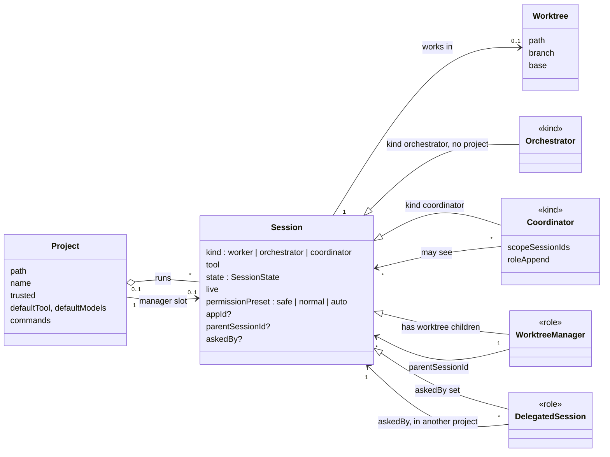

- A session belongs to **at most one** project. With no project: the orchestrator, a coordinator, the builder or
  app-agent session of a user-folder app (it stands under that app's row in the sidebar), and a session in the trash
  (its project is kept in the trash record). The inbox and the palette label every session with no project
  "Orchestrator".
- `kind` is all a session is created as. Every other role is read off a relationship each time: a manager has
  children or is named in the project's manager slot; a builder is named in the builder map; an app-agent session
  carries an `appId` the builder map does not point back to; a delegated session has `askedBy`. Moving a role into a
  stored flag was avoided on purpose, so the flag cannot drift from the relationship (#13, #80).
- The tool profile follows from these, first match wins: orchestrator, coordinator (`scoped`), builder, manager,
  ordinary session in a project (`reader`, unless Settings turns it off), none (`toolProfileOf`).

Where it is stored:

- `projects`: projects, their trust, defaults, saved commands, worktree setup and manager slot.
- `sessions`: sessions, including kind, worktree, parent, app, asked-by and trash marks.
- `command_cache`: the slash commands (skills) a tool offers in a folder, so a session that is not live can list them.

Live only (host memory): `live`, the pending approval and questions, goal, background tasks, agent version.

### 2.2 The conversation and decisions

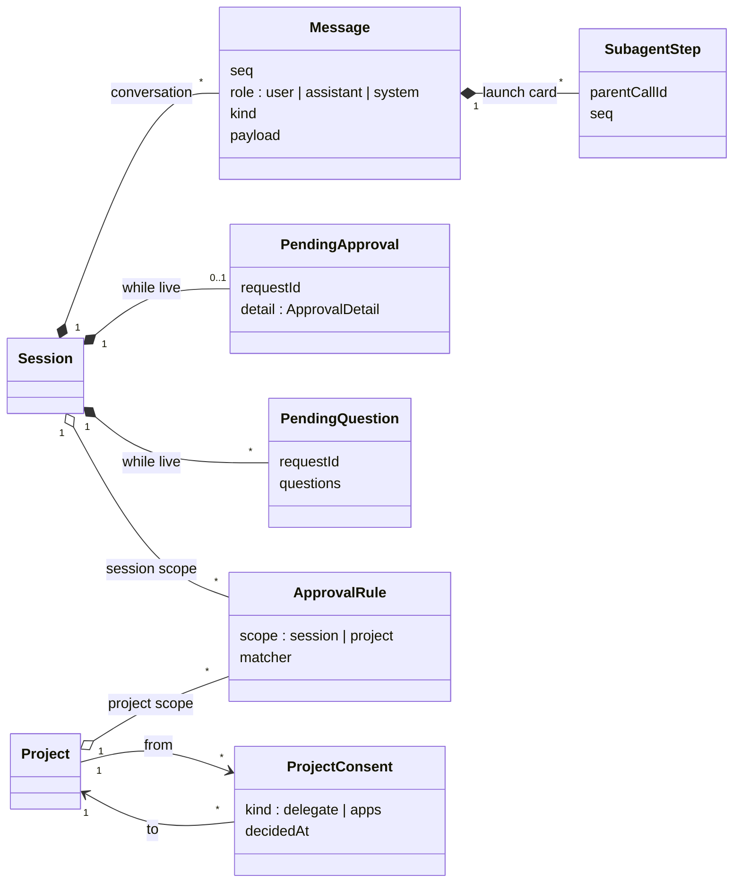

- A pending approval or question lives in the host's memory while the session's process is alive. What was asked
  and how it was answered is also written into the conversation (message kind `approval`), so it survives.
  It closes when it is answered, when Stop refuses it, or when the agent withdraws it: Claude Code cancelling the
  permission request, Codex ending the request or the turn it was asked in, or the process going away.
- An approval rule only ever matches a `command`, and only "always allow" is stored. Answering "always" on a
  `project_access` card stores a project consent instead; a `capability` card is remembered per app either way
  (§2.3).
- A subagent's steps are stored apart from the conversation so a running subagent never moves the conversation's
  numbering (#222).

Where it is stored:

- `messages`: the conversation, one row per message.
- `messages_fts`: the full-text index over messages (trigram, for conversation search).
- `subagent_messages`: subagent steps, keyed by the tool call that launched them.
- `approval_rules`: "always allow" command rules.
- `project_consents`: one project's remembered consent to reach another.

### 2.3 Apps

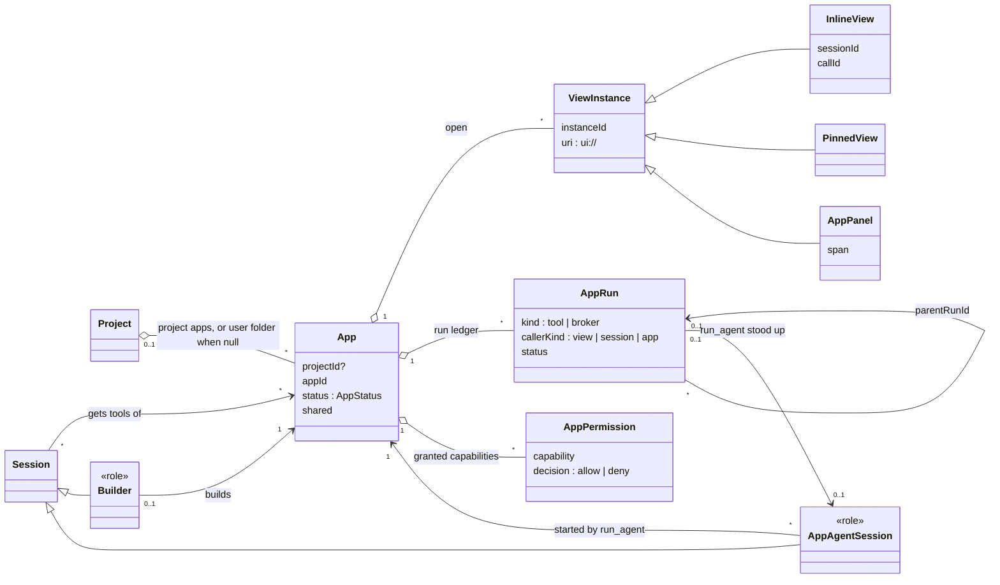

Which apps a session gets (`givesApp`, `session-apps.ts`; `allowed`, `app-access.ts`):

| Session | Gets by default | May attach |
|---|---|---|
| Orchestrator | user-folder apps | |
| Session in a trusted project | that project's apps | user-folder apps; another project's app if it is shared and the project consent (`apps`) is given |
| Builder | its own app, too | as above |
| App-agent session | none | none |

An app that is `invalid`, `untrusted`, `unconfirmed` or `failed` is given to nobody.

Where it is stored:

- `app_runs`: the run ledger.
- `app_run_failures`: the raw arguments and result of an app's latest failed calls (20 kept), for its builder.
- `app_permissions`: a person's answer per app and capability, with the `uses` fingerprint it was given for.
- `app_settings`: host-owned settings as key and value; for apps the builder map (`apps.builders`), sharing
  (`app_shared:*`), on-demand attachments (`session_apps:*`), view ports and the view handover. Also the store's own
  bookkeeping (`min_reader_version`, deferred migrations) and settings such as updates.

Outside the store: the app's code (its folder), data (`<data>/app-data/`), secrets (`<data>/app-secrets.json`),
import confirmations (`<data>/app-imports.json`), kept versions (`<data>/app-versions/`), logs (`<data>/app-logs/`).

### 2.4 Layout, history and usage

| Concept | Meaning |
|---|---|
| Grid layout | Which panels the grid shows, in order: a session or an app, with an app panel's span |
| Workspace snapshot | The UI's state as one blob, written by the UI, read back at start |
| Commit attribution | Which session made a commit, picked up from the agent's `git commit` output; kept only here, never in the repository (#50) |
| Usage facts | A table for tokens and cost per day, tool, model and project that **nothing reads or writes**: no build ever wrote a row, and releases up to v0.1.0-beta.10 only deleted a deleted project's rows. The usage people see is the account's limits, read live (`UsageSnapshot`, [agent-host.md](agent-host.md) §6) |

Where it is stored:

- `grid_layout`: the grid's panels (sessions and apps, store v42; spans v43; a linked machine's session in a column
  of its own, v46).
- `grid_panels`: the grid of session panels as v9 made it, kept for hosts older than v42 (this build copies it once
  and afterwards only removes a trashed session's row); dropped in a later contract step
  ([agent-host.md](agent-host.md) §5.1).
- `workspace`: the UI's snapshot, one row.
- `commit_sessions`: commit attribution.
- `usage_facts`: unused (above); dropped in a later contract step ([agent-host.md](agent-host.md) §5.1).

## 3. Session state

`packages/core/src/session/state-machine.ts`. Every change of state goes through this table; the UI never infers a
state with its own conditions.

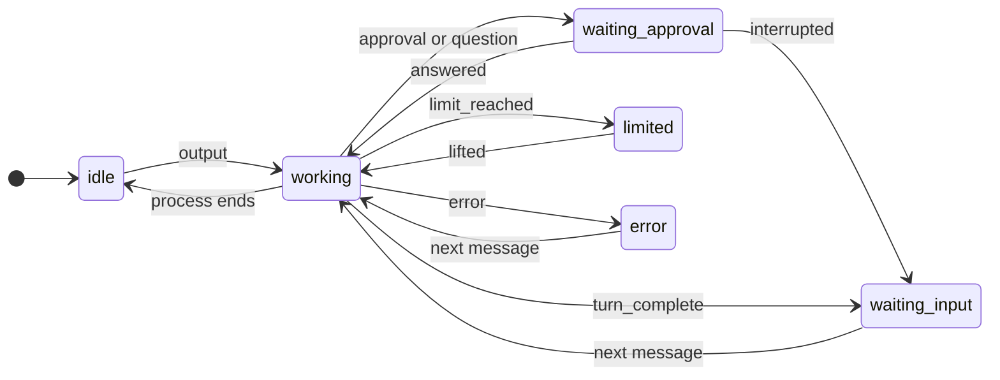

The diagram shows the usual moves; the table is the complete list (`ALLOWED`). Every state may also go to `error`
except `error` itself, and every state but `idle` may go to `idle` when the process ends.

| From | Allowed to |
|---|---|
| `idle` | `working`, `error` |
| `working` | `waiting_approval`, `waiting_input`, `limited`, `error`, `idle` |
| `waiting_approval` | `working`, `waiting_input`, `error`, `idle` |
| `waiting_input` | `working`, `error`, `idle` |
| `limited` | `working`, `idle`, `error` |
| `error` | `working`, `idle` |

- `waiting_approval` covers both an approval and a question: both block the agent on the person.
- `waiting_input` means the turn ended. It counts as waiting (`isWaiting`), so it stands in the inbox, but its
  urgency is below `error` (`URGENCY`): an approval blocks the agent, a finished turn does not.
- An `approval_request` or `question_request` is applied in **any** state: it is a fact the host received, not an
  inference, and a table that swallowed one would leave the agent blocked unseen. Only inferred moves are checked
  against the table; an illegal one is ignored and logged.
- The last state is stored on the session row (`sessions.state`); whether a process is alive (`live`) is not.

## 4. Process topology

Who starts whom, and who talks to whom over what. The parent/child edges are solid; connections are dashed.

### 4.1 With a keeper (macOS release builds; Linux or a debug build with `CC_USE_KEEPER=1`)

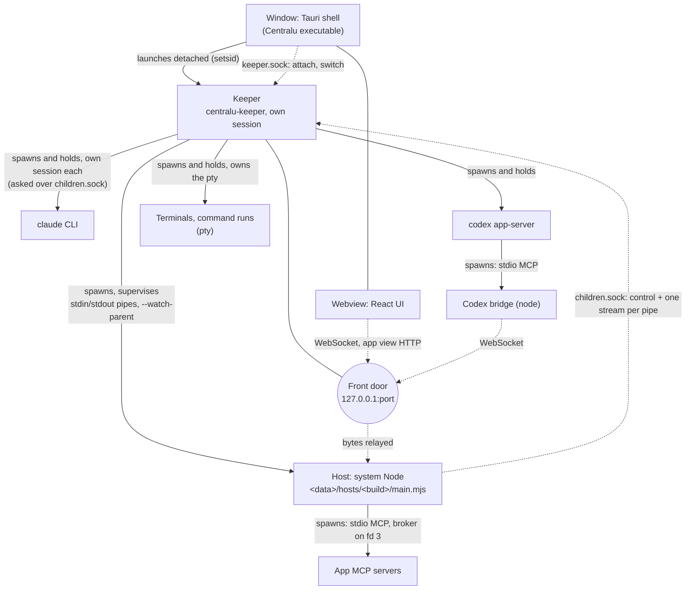

- The keeper is an executable of its own beside the window's, launched detached so quitting the app sends it nothing. It
  starts the host from the per-build copy, with the front door's token in `CC_HOST_TOKEN`, and swaps it blue-green.
  A host dies with its keeper (`--watch-parent` on the keeper's pipe).
- Agent CLIs, terminals and command runs are the **keeper's** children, spawned when the host asks over
  `children.sock`; their bytes reach the host through that socket. A host that restarts or is swapped re-attaches to
  them, so a running turn goes on.
- App MCP servers are the **host's** children and stop with it (owner decision 2, [architecture.md](architecture.md)
  §4.3). The next host starts them again when they are needed.
- Claude's Centralu tools and app proxies run **inside the host** (in-process SDK MCP servers), reached over the
  CLI's own stdio. Codex has no in-process servers, so it starts a bridge per session that calls back over the front
  door.
- App views are served by the host over HTTP through the front door. An app that asks for its own origin
  (`view.origin: app`) gets a port of its own on the host, outside the front door (`views/origin-ports.ts`).
- A keeper hands itself over to a newer keeper (§1.5) by passing every descriptor; the host and every child keep
  running and nothing reconnects.

### 4.2 Without a keeper (Windows, debug builds, `pnpm dev`, `centralu serve`)

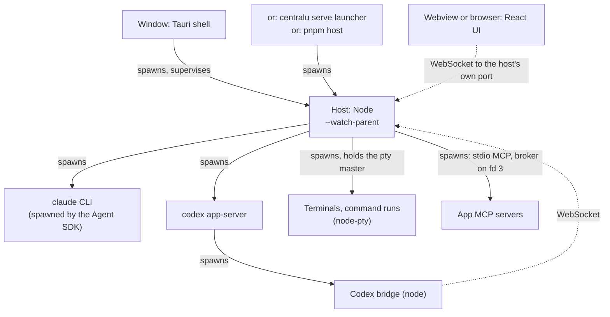

- The Tauri shell is the host's parent (`sidecar.rs`, the same `host_proc` supervisor the keeper uses). In browser
  development (`pnpm host` and `pnpm dev`) the browser connects to the host directly with the token from the shell.
- Every child is the host's own, so a host restart ends them.
- `centralu serve` is this mode with no window at all, bound to loopback and reached over an SSH forward.

## 5. Main flows

### 5.1 A turn with an approval, answered "always for this project"

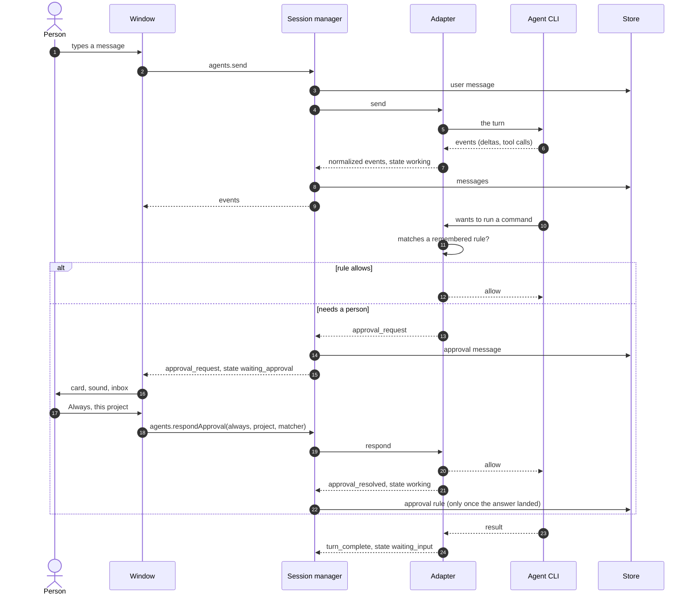

The rule is stored only after the adapter confirms the answer landed: an answer to a request that is already gone
(the process was replaced) removes the card and stores nothing.

### 5.2 Delegation to another project (`ask_project`)

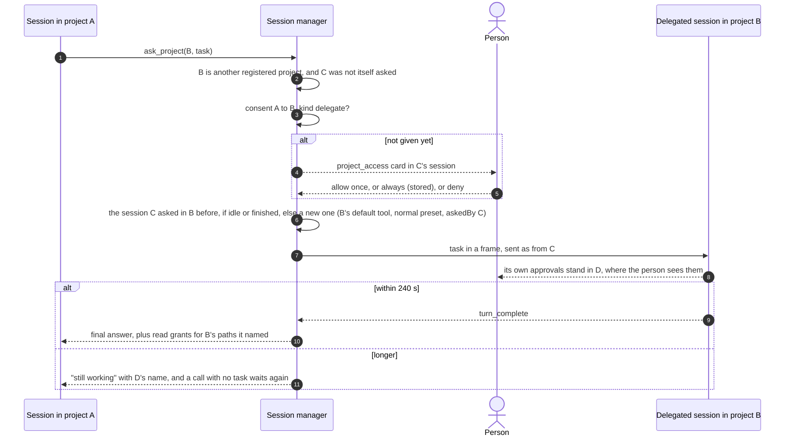

Depth is one: a delegated session cannot ask a third project. A second task to the same project while one runs is
refused. Read grants live in the host's memory and end with it. Stopping the caller stops the delegated turn.
Detail: [agent-host.md](agent-host.md) §1.2.

### 5.3 An app calling `run_agent`

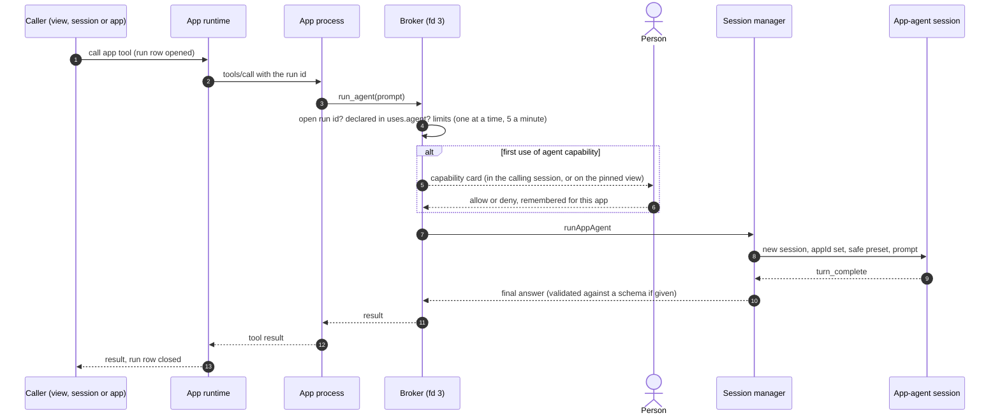

Each `run_agent` stands up a new session; nothing is reused. The broker's request gets its own run row under the
tool call's (`parentRunId`), linked to the session it stood up.

### 5.4 Switching builds (blue-green swap, with a keeper)

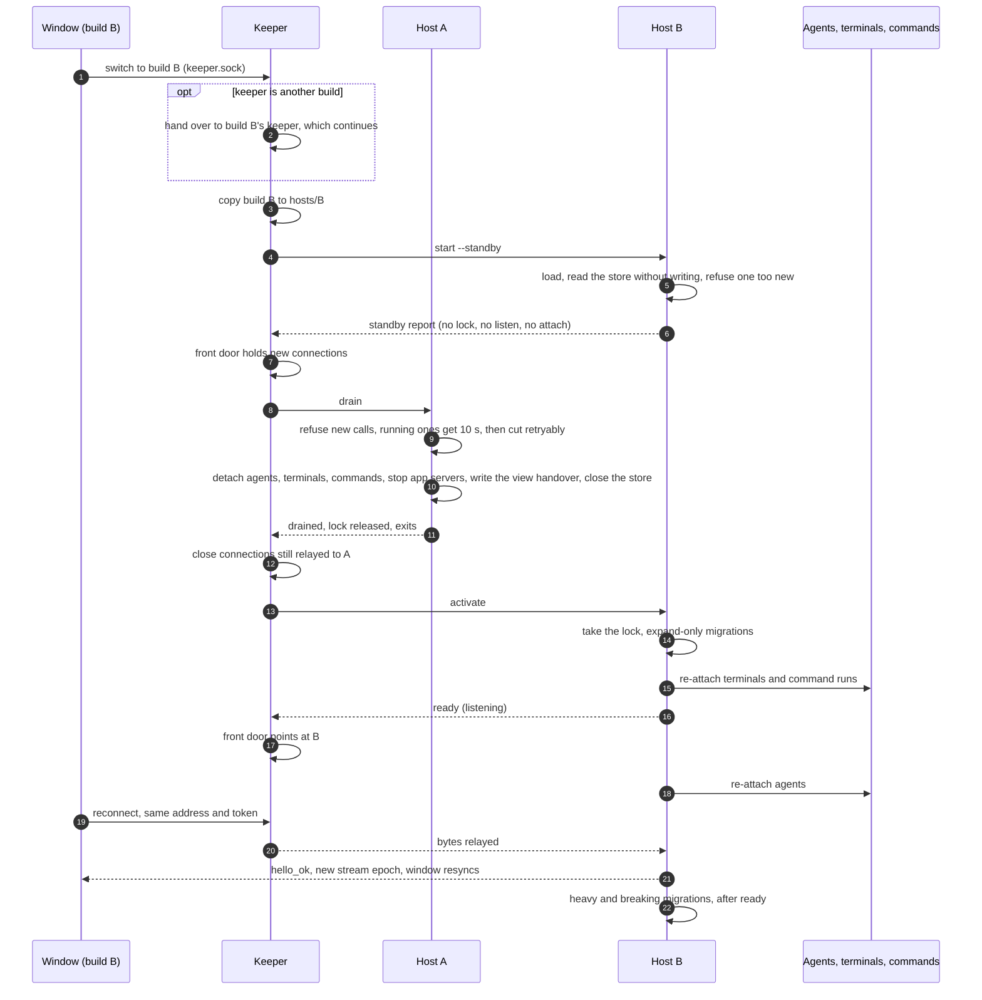

If B fails after A drained, the keeper starts A's build again from its kept copy. Every phase is pushed to windows
(`view.swap`). Detail: [architecture.md](architecture.md) §4.2, [agent-host.md](agent-host.md) §4.2.

## 6. Machines

Remote mode as linked hosts ([plans/remote-hub.md](plans/remote-hub.md), phase 1) adds a **Machine**: a computer
running its own host with its own store, agents and sign-ins. The host a window is attached to is the **hub** for it:
the person links other machines to it, each reached over the person's own ssh, and the hub shows their sessions and
projects next to its own. Hosts talk only to hosts; each machine stays the one writer of its own store.

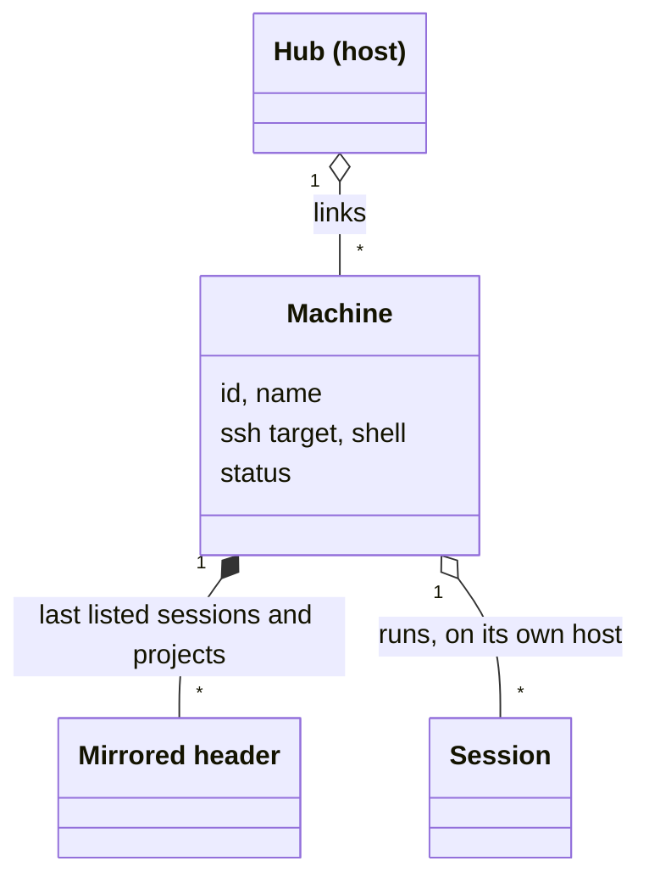

- A machine's sessions, projects and terminals keep their ids on their own host; the hub qualifies them as
  `<machine>.<id>` and every row carries an explicit `machine` field, so the UI never parses an id. An approval rule
  id from a machine is folded into a negative number per machine (its `slot`).
- What the hub last heard from a machine is mirrored, so a machine that is away still lists its sessions (marked
  unreachable, last-known `live`, never woken). The remote's orchestrator and coordinators are not shown.
- The link's state (`connecting`, `connected`, `unreachable`, `versions_differ`, ...) is live only and sent as
  `machine_status`; a (re)connect says `machine_resync`. Detail: [agent-host.md](agent-host.md) §4.8,
  [protocol.md](protocol.md) §6.

Where it is stored:

- `linked_machines`: the machines the person linked: id, name, ssh target, remote shell, the slot for folding
  numbers, the version pair accepted (store v46).
- `machine_headers`: the mirror: each machine's sessions and projects as it last listed them (store v46).

Live only (hub memory): each link's status, its ssh processes and forward, the remote's cursor and epoch. Not stored
anywhere: the remote host's token, asked over ssh at every link start.
