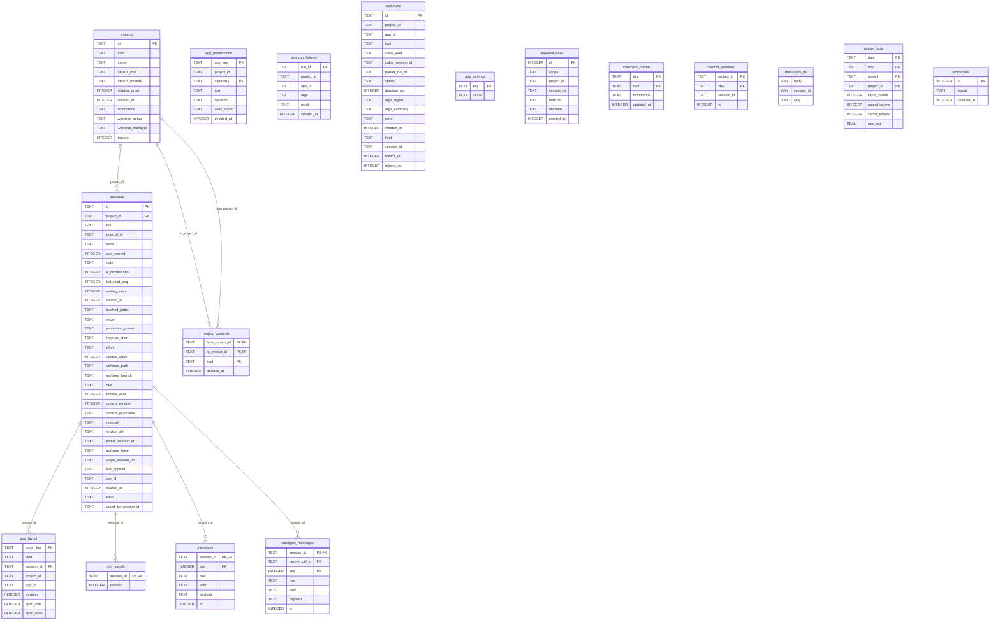

<!-- Generated by `pnpm docs:schema` (packages/agent-host/scripts/schema-doc.mts). Do not edit by hand. -->

# Store schema

The tables of the host's store (`store.db`) at schema version 45, as a new store has them once
schema.sql and every migration step have run. Generated from a real `Store`
(`packages/agent-host/src/dev-services/schema-doc.ts`); a test fails when this file and the migrations disagree.

What the tables mean, and which concept each one stores, is in [the domain model](../domain-model.md).
How a migration may change them is in [agent-host.md](../agent-host.md) and above `migrationSteps` in
`packages/agent-host/src/dev-services/store.ts`.

"Added in" is the first step that gives a new store the table or column: `schema.sql`, the migration runner
(its own bookkeeping, before any step), or the migration step `v<N>`. A column that a step added to older stores
and schema.sql now creates for new ones reads `schema.sql`.
Only foreign keys the schema declares are drawn; references kept by convention (such as
`approval_rules.session_id`) are described in the domain model.

## Diagram

## Tables

### `app_permissions`

Added in v36.

| Column | Type | Null | Default | Key | Added in |
|---|---|---|---|---|---|
| `app_key` | TEXT | no |  | PK 1 | v36 |
| `project_id` | TEXT | yes |  |  | v36 |
| `capability` | TEXT | no |  | PK 2 | v36 |
| `text` | TEXT | no |  |  | v36 |
| `decision` | TEXT | no |  |  | v36 |
| `uses_stamp` | TEXT | no |  |  | v36 |
| `decided_at` | INTEGER | no |  |  | v36 |

### `app_run_failures`

Added in v34.

| Column | Type | Null | Default | Key | Added in |
|---|---|---|---|---|---|
| `run_id` | TEXT | yes |  | PK | v34 |
| `project_id` | TEXT | yes |  |  | v34 |
| `app_id` | TEXT | no |  |  | v34 |
| `args` | TEXT | no |  |  | v34 |
| `result` | TEXT | yes |  |  | v34 |
| `created_at` | INTEGER | no |  |  | v34 |

### `app_runs`

Added in v34.

| Column | Type | Null | Default | Key | Added in |
|---|---|---|---|---|---|
| `id` | TEXT | yes |  | PK | v34 |
| `project_id` | TEXT | yes |  |  | v34 |
| `app_id` | TEXT | no |  |  | v34 |
| `tool` | TEXT | no |  |  | v34 |
| `caller_kind` | TEXT | no |  |  | v34 |
| `caller_session_id` | TEXT | yes |  |  | v34 |
| `parent_run_id` | TEXT | yes |  |  | v34 |
| `status` | TEXT | no |  |  | v34 |
| `duration_ms` | INTEGER | yes |  |  | v34 |
| `args_digest` | TEXT | no |  |  | v34 |
| `args_summary` | TEXT | no |  |  | v34 |
| `error` | TEXT | yes |  |  | v34 |
| `created_at` | INTEGER | no |  |  | v34 |
| `kind` | TEXT | no | `'tool'` |  | v37 |
| `session_id` | TEXT | yes |  |  | v37 |
| `tokens_in` | INTEGER | yes |  |  | v38 |
| `tokens_out` | INTEGER | yes |  |  | v38 |

Indexes:

- `idx_app_runs_app`: `app_id`, `project_id`, `created_at`
- `idx_app_runs_parent`: `parent_run_id`

### `app_settings`

Added in the migration runner.

| Column | Type | Null | Default | Key | Added in |
|---|---|---|---|---|---|
| `key` | TEXT | yes |  | PK | the migration runner |
| `value` | TEXT | no |  |  | the migration runner |

### `approval_rules`

Added in schema.sql.

| Column | Type | Null | Default | Key | Added in |
|---|---|---|---|---|---|
| `id` | INTEGER | yes |  | PK | schema.sql |
| `scope` | TEXT | no |  |  | schema.sql |
| `project_id` | TEXT | yes |  |  | schema.sql |
| `session_id` | TEXT | yes |  |  | schema.sql |
| `matcher` | TEXT | no |  |  | schema.sql |
| `decision` | TEXT | no |  |  | schema.sql |
| `created_at` | INTEGER | no |  |  | schema.sql |

### `command_cache`

Added in v6.

| Column | Type | Null | Default | Key | Added in |
|---|---|---|---|---|---|
| `tool` | TEXT | no |  | PK 1 | v6 |
| `cwd` | TEXT | no |  | PK 2 | v6 |
| `commands` | TEXT | no |  |  | v6 |
| `updated_at` | INTEGER | no |  |  | v6 |

### `commit_sessions`

Added in schema.sql.

| Column | Type | Null | Default | Key | Added in |
|---|---|---|---|---|---|
| `project_id` | TEXT | no |  | PK 1 | schema.sql |
| `sha` | TEXT | no |  | PK 2 | schema.sql |
| `session_id` | TEXT | no |  |  | schema.sql |
| `ts` | INTEGER | no |  |  | schema.sql |

### `grid_layout`

Added in v42.

| Column | Type | Null | Default | Key | Added in |
|---|---|---|---|---|---|
| `panel_key` | TEXT | yes |  | PK | v42 |
| `kind` | TEXT | no |  |  | v42 |
| `session_id` | TEXT | yes |  | FK → `sessions.id` (cascade) | v42 |
| `project_id` | TEXT | yes |  |  | v42 |
| `app_id` | TEXT | yes |  |  | v42 |
| `position` | INTEGER | no |  |  | v42 |
| `span_cols` | INTEGER | yes |  |  | v43 |
| `span_rows` | INTEGER | yes |  |  | v43 |

### `grid_panels`

Added in v9.

| Column | Type | Null | Default | Key | Added in |
|---|---|---|---|---|---|
| `session_id` | TEXT | yes |  | PK, FK → `sessions.id` (cascade) | v9 |
| `position` | INTEGER | no |  |  | v9 |

### `messages`

Added in schema.sql.

| Column | Type | Null | Default | Key | Added in |
|---|---|---|---|---|---|
| `session_id` | TEXT | no |  | PK 1, FK → `sessions.id` (cascade) | schema.sql |
| `seq` | INTEGER | no |  | PK 2 | schema.sql |
| `role` | TEXT | no |  |  | schema.sql |
| `kind` | TEXT | no |  |  | schema.sql |
| `payload` | TEXT | no |  |  | schema.sql |
| `ts` | INTEGER | no |  |  | schema.sql |

### `messages_fts`

Virtual table. Added in v3.

| Column | Type | Null | Default | Key | Added in |
|---|---|---|---|---|---|
| `body` | — | yes |  |  | v3 |
| `session_id` | — | yes |  |  | v3 |
| `seq` | — | yes |  |  | v3 |

### `project_consents`

Added in v44.

| Column | Type | Null | Default | Key | Added in |
|---|---|---|---|---|---|
| `from_project_id` | TEXT | no |  | PK 1, FK → `projects.id` (cascade) | v44 |
| `to_project_id` | TEXT | no |  | PK 2, FK → `projects.id` (cascade) | v44 |
| `kind` | TEXT | no |  | PK 3 | v44 |
| `decided_at` | INTEGER | no |  |  | v44 |

### `projects`

Added in schema.sql.

| Column | Type | Null | Default | Key | Added in |
|---|---|---|---|---|---|
| `id` | TEXT | yes |  | PK | schema.sql |
| `path` | TEXT | no |  |  | schema.sql |
| `name` | TEXT | no |  |  | schema.sql |
| `default_tool` | TEXT | no | `'claude'` |  | schema.sql |
| `default_models` | TEXT | yes |  |  | schema.sql |
| `sidebar_order` | INTEGER | no | `0` |  | schema.sql |
| `created_at` | INTEGER | no |  |  | schema.sql |
| `commands` | TEXT | no | `'[]'` |  | v15 |
| `worktree_setup` | TEXT | yes |  |  | v23 |
| `worktree_manager` | TEXT | yes |  |  | v27 |
| `trusted` | INTEGER | no | `0` |  | v33 |

### `sessions`

Added in schema.sql.

| Column | Type | Null | Default | Key | Added in |
|---|---|---|---|---|---|
| `id` | TEXT | yes |  | PK | schema.sql |
| `project_id` | TEXT | yes |  | FK → `projects.id` (cascade) | schema.sql |
| `tool` | TEXT | no |  |  | schema.sql |
| `external_id` | TEXT | yes |  |  | schema.sql |
| `name` | TEXT | no |  |  | schema.sql |
| `auto_named` | INTEGER | no | `1` |  | schema.sql |
| `state` | TEXT | no | `'idle'` |  | schema.sql |
| `is_orchestrator` | INTEGER | no | `0` |  | schema.sql |
| `last_read_seq` | INTEGER | no | `0` |  | schema.sql |
| `waiting_since` | INTEGER | yes |  |  | schema.sql |
| `created_at` | INTEGER | no |  |  | schema.sql |
| `touched_paths` | TEXT | no | `'[]'` |  | v2 |
| `model` | TEXT | yes |  |  | v4 |
| `permission_preset` | TEXT | no | `'normal'` |  | v4 |
| `imported_from` | TEXT | yes |  |  | v5 |
| `effort` | TEXT | yes |  |  | v7 |
| `sidebar_order` | INTEGER | no | `0` |  | v8 |
| `worktree_path` | TEXT | yes |  |  | v12 |
| `worktree_branch` | TEXT | yes |  |  | v12 |
| `cwd` | TEXT | yes |  |  | v14 |
| `context_used` | INTEGER | yes |  |  | v17 |
| `context_window` | INTEGER | yes |  |  | v17 |
| `context_exactness` | TEXT | yes |  |  | v17 |
| `verbosity` | TEXT | yes |  |  | v18 |
| `service_tier` | TEXT | yes |  |  | v20 |
| `parent_session_id` | TEXT | yes |  |  | v22 |
| `worktree_base` | TEXT | yes |  |  | v24 |
| `scope_session_ids` | TEXT | yes |  |  | v30 |
| `role_append` | TEXT | yes |  |  | v30 |
| `app_id` | TEXT | yes |  |  | v31 |
| `deleted_at` | INTEGER | yes |  |  | v39 |
| `trash` | TEXT | yes |  |  | v39 |
| `asked_by_session_id` | TEXT | yes |  |  | v45 |

Indexes:

- `idx_sessions_project`: `project_id`

### `subagent_messages`

Added in v41.

| Column | Type | Null | Default | Key | Added in |
|---|---|---|---|---|---|
| `session_id` | TEXT | no |  | PK 1, FK → `sessions.id` (cascade) | v41 |
| `parent_call_id` | TEXT | no |  | PK 2 | v41 |
| `seq` | INTEGER | no |  | PK 3 | v41 |
| `role` | TEXT | no |  |  | v41 |
| `kind` | TEXT | no |  |  | v41 |
| `payload` | TEXT | no |  |  | v41 |
| `ts` | INTEGER | no |  |  | v41 |

### `usage_facts`

Added in schema.sql.

| Column | Type | Null | Default | Key | Added in |
|---|---|---|---|---|---|
| `date` | TEXT | no |  | PK 1 | schema.sql |
| `tool` | TEXT | no |  | PK 2 | schema.sql |
| `model` | TEXT | no |  | PK 3 | schema.sql |
| `project_id` | TEXT | yes |  | PK 4 | schema.sql |
| `input_tokens` | INTEGER | no | `0` |  | schema.sql |
| `output_tokens` | INTEGER | no | `0` |  | schema.sql |
| `cache_tokens` | INTEGER | no | `0` |  | schema.sql |
| `cost_est` | REAL | no | `0` |  | schema.sql |

### `workspace`

Added in schema.sql.

| Column | Type | Null | Default | Key | Added in |
|---|---|---|---|---|---|
| `id` | INTEGER | yes |  | PK | schema.sql |
| `layout` | TEXT | no |  |  | schema.sql |
| `updated_at` | INTEGER | no |  |  | schema.sql |
